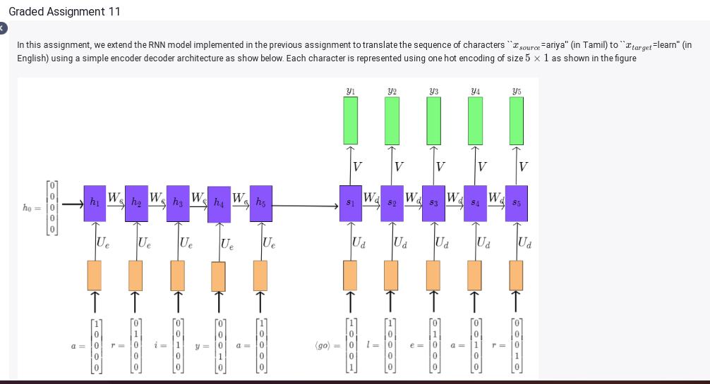
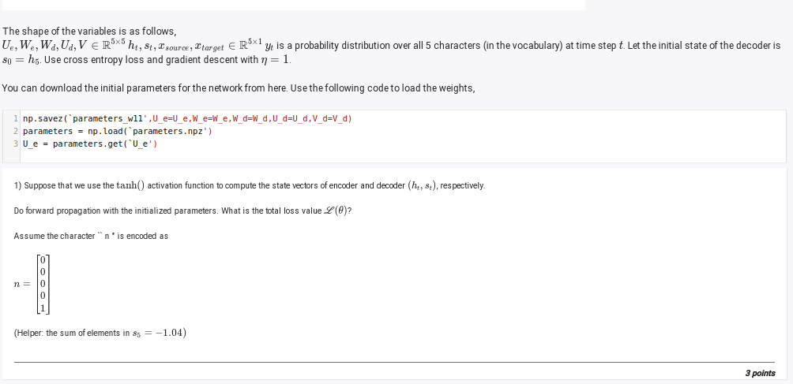

# ga 11




To calculate the total loss value \( L(\theta) \) for this task, let's outline the steps and intermediate computations:

### Key Variables and Notation
- \( x_{\text{source}}, x_{\text{target}} \in \mathbb{R}^{5 \times 1} \): One-hot encoded input/output sequences.
- \( h_t, s_t \in \mathbb{R}^{5 \times 1} \): State vectors for encoder and decoder respectively.
- \( U_e, W_e, W_d, U_d, V \in \mathbb{R}^{5 \times 5} \): Weight matrices for encoder and decoder.
- Activation: \( \tanh \) for computing \( h_t \) and \( s_t \).
- Decoder's initial state: \( s_0 = h_5 \).

### Forward Propagation
1. **Encoder**:
   The encoder processes the sequence \( x_{\text{source}} \):
   \[
   h_t = \tanh(U_e x_t + W_e h_{t-1})
   \]
   where \( h_0 = \mathbf{0} \).

2. **Decoder**:
   The decoder generates the output sequence \( y_t \):
   \[
   s_t = \tanh(U_d x_{t-1} + W_d s_{t-1})
   \]
   \[
   \hat{y}_t = \text{softmax}(V s_t)
   \]
   where \( s_0 = h_5 \).

3. **Loss Function**:
   The loss at time \( t \) is:
   \[
   \ell_t = - \sum_{i=1}^{5} y_{t,i} \log(\hat{y}_{t,i})
   \]
   where \( y_t \) is the true one-hot target vector, and \( \hat{y}_t \) is the predicted probability distribution.

4. **Total Loss**:
   Sum over all time steps:
   \[
   L(\theta) = \sum_{t=1}^{T} \ell_t
   \]

### Given Information
1. \( s_5 = -1.04 \) (sum of elements in \( s_5 \)).
2. Activation is \( \tanh \), and initial parameters are loaded from the file.
3. The learning rate \( \eta = 1 \) will be used for gradient descent after calculating the loss.

### Plan
- Perform the **forward propagation**:
  - Compute \( h_t \) for the encoder.
  - Compute \( s_t \) and \( \hat{y}_t \) for the decoder.
- Compute the **cross-entropy loss** using \( y_t \) and \( \hat{y}_t \).
- Aggregate the total loss \( L(\theta) \).

### Steps to Implement
1. **Load the Parameters**:
   ```python
   import numpy as np

   parameters = np.load("parameters_w11.npz")
   U_e = parameters["U_e"]
   W_e = parameters["W_e"]
   W_d = parameters["W_d"]
   U_d = parameters["U_d"]
   V = parameters["V"]
   ```

2. **Compute Encoder States**:
   - Initialize \( h_0 = \mathbf{0} \).
   - For each character in \( x_{\text{source}} \), compute \( h_t \).

3. **Compute Decoder States and Predictions**:
   - Initialize \( s_0 = h_5 \).
   - For each \( t \), compute \( s_t \) and \( \hat{y}_t \).

4. **Compute Total Loss**:
   - Use the true target sequence \( x_{\text{target}} \).
   - Sum the cross-entropy losses for each time step.

