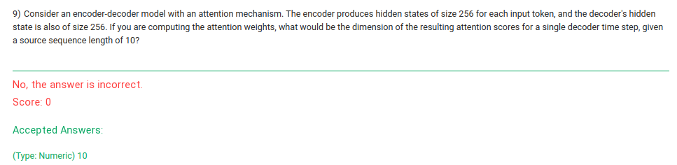
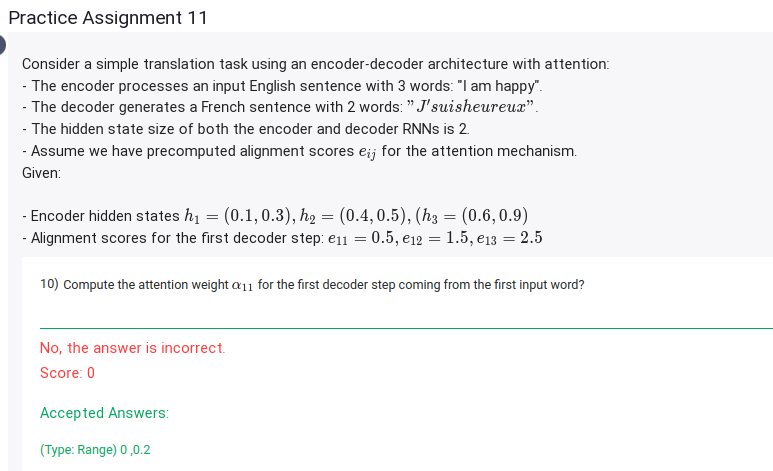
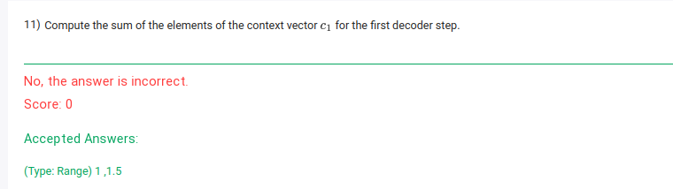

# 9) 

Let's calculate the dimension of the attention scores.

The attention mechanism computes a score for each encoder hidden state relative to the decoder's current hidden state. The steps are as follows:

1. **Input Dimensions**:
   - The encoder produces hidden states of size \(256\) for each of the \(10\) input tokens.
   - The decoder produces a hidden state of size \(256\) at each time step.

2. **Score Calculation**:
   - For a single decoder time step, the attention mechanism typically computes scores for each of the \(10\) encoder hidden states. The scoring function (e.g., dot-product, additive, or scaled dot-product) takes as input:
     - The decoder's hidden state \((1, 256)\).
     - All encoder hidden states \((10, 256)\).
   - The output of the scoring function is a vector of \(10\) scores, one for each encoder hidden state.

3. **Resulting Dimension**:
   - The attention scores for a single decoder time step will have a dimension of \(10\), corresponding to the source sequence length.

Thus, the correct dimension of the attention scores for a single decoder time step is **10**.

# 10) 
- 

To compute the attention weight \(\alpha_{11}\) for the first decoder step coming from the first input word, we use the **softmax** function over the alignment scores \(e_{ij}\) for all input words. Here's the process:

### Step 1: Compute Softmax
The softmax function for a given score \(e_{ij}\) is:

\[
\alpha_{ij} = \frac{\exp(e_{ij})}{\sum_{k=1}^{3} \exp(e_{ik})}
\]

For the first decoder step (\(i=1\)):

- \(e_{11} = 0.5\)
- \(e_{12} = 1.5\)
- \(e_{13} = 2.5\)

### Step 2: Calculate Exponentials
Compute \(\exp(e_{11})\), \(\exp(e_{12})\), and \(\exp(e_{13})\):

\[
\exp(e_{11}) = \exp(0.5) \approx 1.6487
\]
\[
\exp(e_{12}) = \exp(1.5) \approx 4.4817
\]
\[
\exp(e_{13}) = \exp(2.5) \approx 12.1825
\]

### Step 3: Compute the Denominator
The denominator is the sum of all exponentials:

\[
\sum_{k=1}^{3} \exp(e_{1k}) = \exp(e_{11}) + \exp(e_{12}) + \exp(e_{13})
\]
\[
\sum_{k=1}^{3} \exp(e_{1k}) \approx 1.6487 + 4.4817 + 12.1825 = 18.3129
\]

### Step 4: Compute \(\alpha_{11}\)
Finally, compute the attention weight for the first input word:

\[
\alpha_{11} = \frac{\exp(e_{11})}{\sum_{k=1}^{3} \exp(e_{1k})}
\]
\[
\alpha_{11} = \frac{1.6487}{18.3129} \approx 0.09
\]

### Final Answer:
\[
\alpha_{11} \approx 0.09
\]

# 11) 

To compute the **sum of the elements of the context vector** \(c_1\) for the first decoder step, follow these steps:

### Step 1: Recall the Formula for the Context Vector
The context vector \(c_1\) is a weighted sum of the encoder hidden states:

\[
c_1 = \sum_{j=1}^{3} \alpha_{1j} h_j
\]

Where:
- \(h_j = (h_{j1}, h_{j2})\) is the hidden state of the \(j\)-th encoder step.
- \(\alpha_{1j}\) is the attention weight for the \(j\)-th encoder step during the first decoder step.

### Step 2: Compute the Attention Weights
From the previous calculation, we know the alignment scores and their exponentials:
- \(e_{11} = 0.5\), \(e_{12} = 1.5\), \(e_{13} = 2.5\)
- \(\exp(e_{11}) = 1.6487\), \(\exp(e_{12}) = 4.4817\), \(\exp(e_{13}) = 12.1825\)
- Denominator: \(\sum_{k=1}^{3} \exp(e_{1k}) = 18.3129\)

Compute \(\alpha_{1j}\) for \(j = 1, 2, 3\):
\[
\alpha_{11} = \frac{\exp(e_{11})}{\sum_{k=1}^{3} \exp(e_{1k})} = \frac{1.6487}{18.3129} \approx 0.09
\]
\[
\alpha_{12} = \frac{\exp(e_{12})}{\sum_{k=1}^{3} \exp(e_{1k})} = \frac{4.4817}{18.3129} \approx 0.245
\]
\[
\alpha_{13} = \frac{\exp(e_{13})}{\sum_{k=1}^{3} \exp(e_{1k})} = \frac{12.1825}{18.3129} \approx 0.665
\]

### Step 3: Use the Encoder Hidden States
The encoder hidden states are:
\[
h_1 = (0.1, 0.3), \, h_2 = (0.4, 0.5), \, h_3 = (0.6, 0.9)
\]

### Step 4: Compute the Weighted Sum
For \(c_1 = \sum_{j=1}^{3} \alpha_{1j} h_j\), compute element-wise:

\[
c_1 = \alpha_{11} h_1 + \alpha_{12} h_2 + \alpha_{13} h_3
\]
\[
c_1 = 0.09 \cdot (0.1, 0.3) + 0.245 \cdot (0.4, 0.5) + 0.665 \cdot (0.6, 0.9)
\]

Compute each term:
- \(0.09 \cdot (0.1, 0.3) = (0.009, 0.027)\)
- \(0.245 \cdot (0.4, 0.5) = (0.098, 0.1225)\)
- \(0.665 \cdot (0.6, 0.9) = (0.399, 0.5985)\)

Sum the components:
\[
c_1 = (0.009 + 0.098 + 0.399, 0.027 + 0.1225 + 0.5985)
\]
\[
c_1 = (0.506, 0.748)
\]

### Step 5: Compute the Sum of Elements
The sum of the elements of \(c_1\) is:
\[
\text{Sum} = 0.506 + 0.748 = 1.254
\]

### Final Answer:
\[
\text{Sum of the elements of } c_1 \approx 1.254
\]