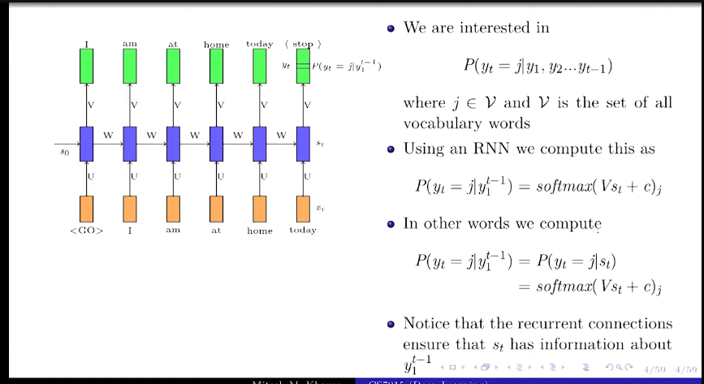
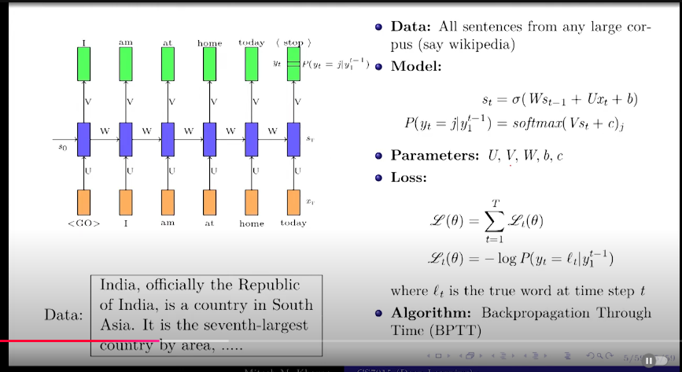
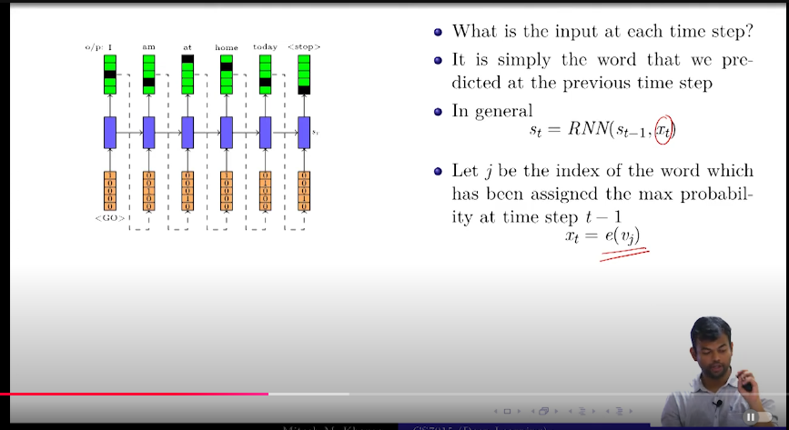
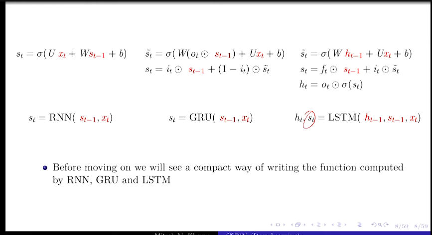
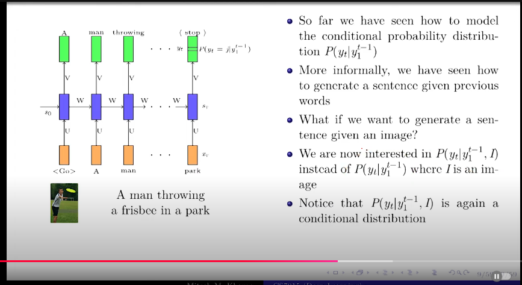
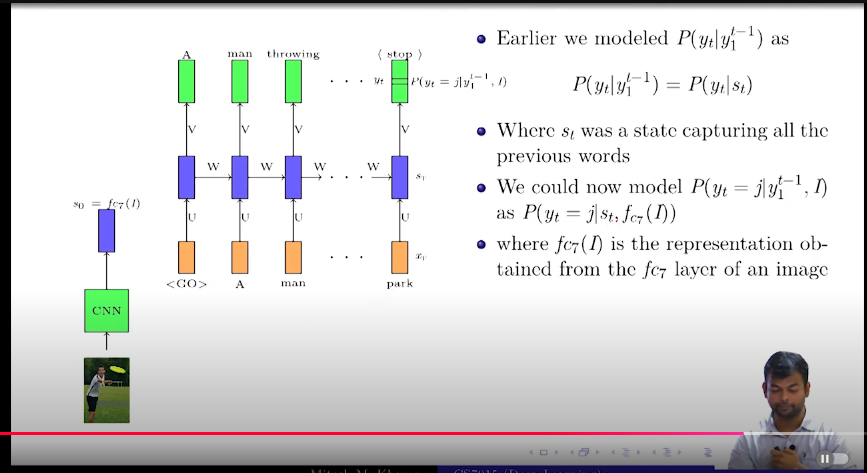
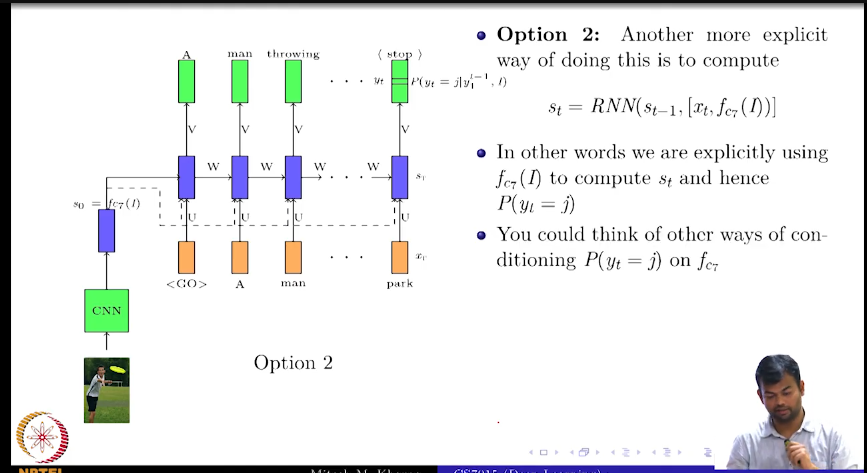
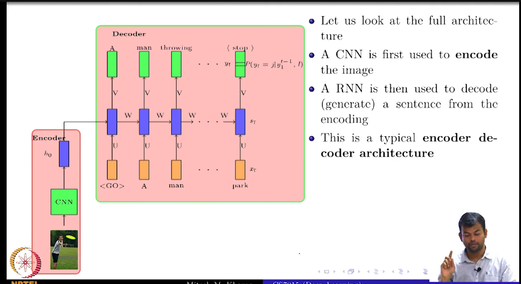

# Deep Learning(CS7015): Lec 15.1 Introduction to Encoder Decoder Models

- what is the problem of  language modelling?
    - given t-1 words, predict the t-th word,(auto complete)
    - y*=argmax P(yt|y1,y2,...,yt-1)

- how to  models this using an RNN?
    - at every time step, we predict the next word by finding the probability distribution of the next word given the previous words
    - P(yt|y1,y2,...,yt-1)=softmax(vst+c)j
        - softmax means probability distribution
        - it takes input as the Vst -> state
            - V - vocabulary 
            - c is bias
            - j is the jth word in the vocabulary
            - Vst + c is  the scalar vector matrix of size vocabulary
            - St -> state thhat has captured the information of the previous words that happened so far
    

- Five things that happen in any supervised machine learning setup
    - Data
        - all sentence from any large corpus
    - model
        - 
    - parameter
    - objective function
    - learning algorithm

- input is going to be a one hot vector of the previous word, means only the prev word will be 1 and rest 0

- what if we want to generate a sentence given an image?

- whatever info we have in the image  we need to pass it 

