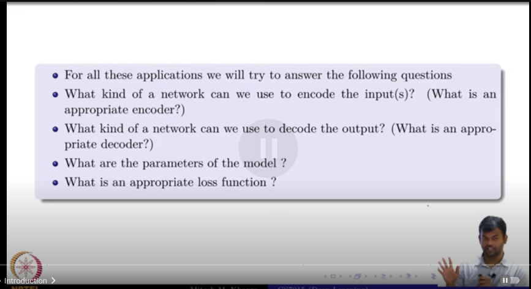
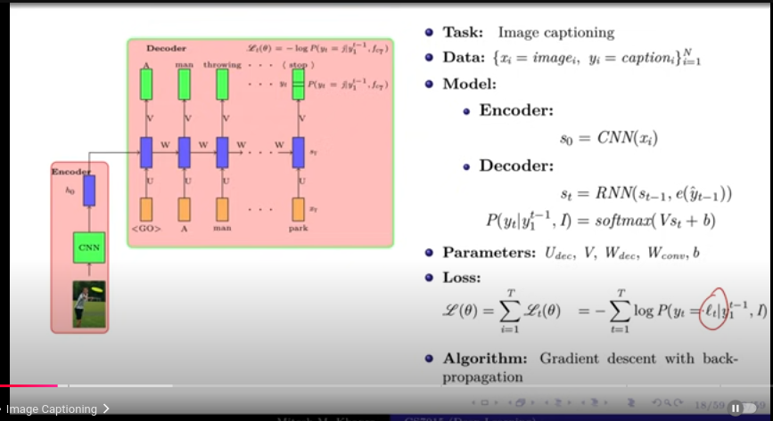
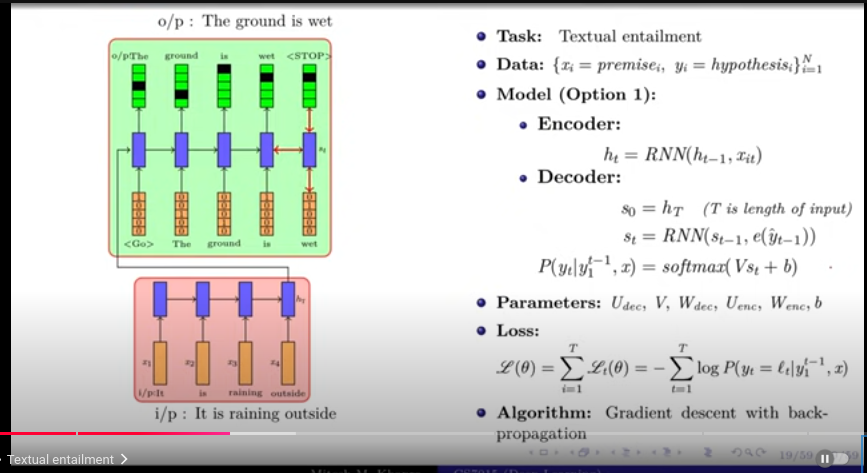
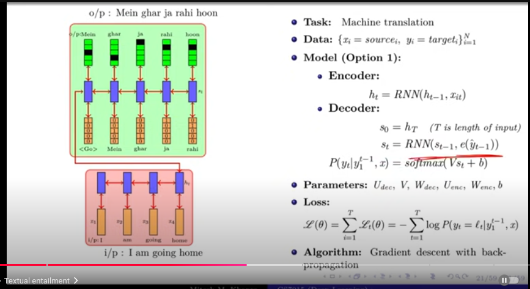

# Deep Learning(CS7015): Lec 15.2 Applications of Encoder Decoder models

- we will see the applications of encoder decoder models

- for all the  application we will answer the  
- 

- CNN can be  represented as follows:
    - FC 7 - representation of the image
        - FC 7 means fully connected layer 7, which is the 7th layer of the CNN,
            - in FC7
    - con 5 representation of the image
        - con 5 means convolutional layer 5, which is the 5th layer of the CNN,
            - in con 5
    - max pooling 5 - representation of the image
        - max pooling 5 means max pooling layer 5, which is the 5th layer of the CNN,
            - in max pooling 5

    - e means embedding, onehot or word2vec
        - onehot means one hot vector, which is a vector of 0s and 1s, where 1 represents the word and rest are 0s
        - word2vec is a word embedding technique, which is a vector representation of the word

- loss function is the cross entropy loss
    - cross entropy loss is a loss function used in classification problems
    - it is used to measure the difference between the predicted value and the actual value
    - it is used to update the weights of the model

- What are the parameters of the model?
    - all the params of the CNN (means all the  filters, biases, weights, etc)
    - all the params of the RNN (means W, U, V, etc) 

### Textual entailment
    - it is a task of determining whether a given text entails another text,
        - entail means to involve or include

    - here input is  text sequence and so is the output
    - encoder is RNN
    - decoder is RNN

- 
    - here backpropagation happens all the way through time, 
- in model 2 , we concatenate the output of the encoder(ht) and the current state of the decoder(st) and pass it through a softmax layer to get the output

- Transliteration 
    - it is a task of converting a word from one script to another
    - eg  name :  Gokul -> how to write this in tamil

- IP is a word, (sequence of characters) and OP is a sequence of characters
- IP We will use RNN, OP we will use RNN

- Image Question and Answer