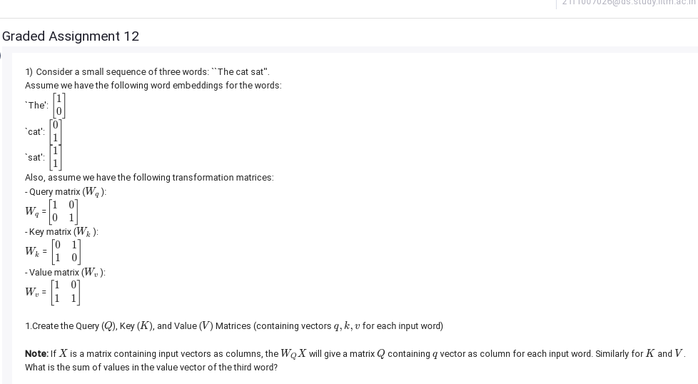
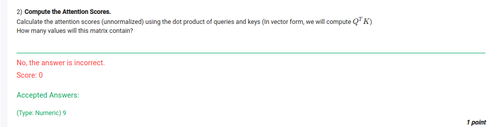
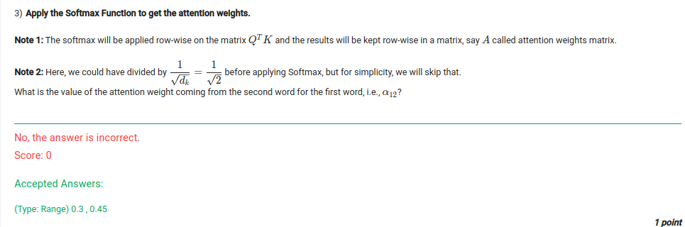

# 1)

To solve this problem, we will follow these steps:

1. Create the input matrix \( X \) by arranging the embedding vectors of the words as columns.
2. Compute the \( Q \), \( K \), and \( V \) matrices using the formula \( Q = W_q X \), \( K = W_k X \), and \( V = W_v X \).
3. Extract the value vector \( v \) for the third word ("sat") from the \( V \) matrix.
4. Sum the values in this vector.

### Step-by-Step Solution

#### Input Embedding Matrix \( X \)
The embedding vectors of the words are:
- "The": \([1, 0]\)
- "cat": \([0, 1]\)
- "sat": \([1, 1]\)

Arrange these as columns of \( X \):
\[
X = \begin{bmatrix}
1 & 0 & 1 \\
0 & 1 & 1
\end{bmatrix}
\]

#### Transformation Matrices
The given transformation matrices are:
\[
W_q = \begin{bmatrix}
1 & 0 \\
0 & 1
\end{bmatrix}, \quad
W_k = \begin{bmatrix}
0 & 1 \\
1 & 0
\end{bmatrix}, \quad
W_v = \begin{bmatrix}
1 & 0 \\
1 & 1
\end{bmatrix}
\]

#### Compute \( Q \), \( K \), and \( V \)
Use the formula \( Q = W_q X \), \( K = W_k X \), and \( V = W_v X \).

Let's calculate these step by step.
```python
import numpy as np

# Input matrix X (embeddings as columns)
X = np.array([
    [1, 0, 1],  # First row of embeddings
    [0, 1, 1]   # Second row of embeddings
])

# Transformation matrices
W_q = np.array([
    [1, 0],
    [0, 1]
])

W_k = np.array([
    [0, 1],
    [1, 0]
])

W_v = np.array([
    [1, 0],
    [1, 1]
])

# Compute Q, K, V matrices
Q = W_q @ X
K = W_k @ X
V = W_v @ X

# Value vector of the third word ("sat")
v_third_word = V[:, 2]

# Sum of values in the value vector of the third word
v_sum_third_word = v_third_word.sum()
print(Q,"q\n" ,K,"k\n", V,'v\n', v_third_word,'sds\n', v_sum_third_word)
```
## Ans : 3


# 2)



To calculate the attention scores using the dot product of the queries and keys, we'll compute the matrix product \( Q^T K \), where:

- \( Q \) is the matrix containing the query vectors.
- \( K \) is the matrix containing the key vectors.
- The resulting matrix will have dimensions corresponding to the number of words in the sequence.

### Step-by-Step Solution:

1. **Query Matrix \( Q \)**:
   - We previously computed the query matrix \( Q \) as \( W_q X \).
   
2. **Key Matrix \( K \)**:
   - Similarly, the key matrix \( K \) is computed as \( W_k X \).

3. **Dot Product \( Q^T K \)**:
   - We will compute the matrix product \( Q^T K \) (the dot product of the query and key matrices).

The number of values in the resulting matrix is determined by the dimensions of \( Q^T \) and \( K \). Since each matrix contains 2 rows (for the 2-dimensional vectors), the product \( Q^T K \) will result in a matrix with dimensions \( 3 \times 3 \), where 3 corresponds to the number of words in the sequence.

Thus, the resulting matrix will contain \( 3 \times 3 = 9 \) values.

Let me know if you need further clarification on the process or if you'd like to explore another part of the solution!

# 3)

To compute the attention weight \( \alpha_{12} \) coming from the second word for the first word, we will follow these steps:

1. **Compute the Dot Product \( Q^T K \)**:
   As discussed earlier, we need to compute the dot product of the query matrix \( Q \) and the key matrix \( K \), which gives us the attention score matrix. This matrix will contain the unnormalized attention scores.

2. **Apply the Softmax Function**:
   After calculating the attention score matrix, we apply the softmax function row-wise to normalize the scores. The softmax function is given by:
   \[
   \text{softmax}(x_i) = \frac{e^{x_i}}{\sum_j e^{x_j}}
   \]
   where \( x_i \) is an element of the row, and the sum is taken over all elements of that row.

3. **Extract the Attention Weight \( \alpha_{12} \)**:
   After applying softmax to each row, the value \( \alpha_{12} \) will be the element in the second column of the first row of the attention weights matrix.

The attention weight \( \alpha_{12} \) corresponds to the normalized score from the second word (indexed 2) for the first word (indexed 1) in the sequence.

Let me walk you through the steps conceptually before moving to the actual calculation.

Let's walk through the steps to compute \( \alpha_{12} \) step by step.

### Step 1: Compute the Dot Product \( Q^T K \)

We first need to compute the matrix \( Q^T K \), where:

- \( Q \) is the query matrix.
- \( K \) is the key matrix.

From earlier, the \( Q \) and \( K \) matrices are:

\[
Q = \begin{bmatrix}
1 & 0 & 1 \\
0 & 1 & 1
\end{bmatrix}
\]

\[
K = \begin{bmatrix}
0 & 1 & 1 \\
1 & 0 & 1
\end{bmatrix}
\]

We compute the dot product \( Q^T K \) to get the attention score matrix.

\[
Q^T = \begin{bmatrix}
1 & 0 \\
0 & 1 \\
1 & 1
\end{bmatrix}
\]

Now, compute the dot product:

\[
Q^T K = \begin{bmatrix}
(1 \cdot 0 + 0 \cdot 1) & (1 \cdot 1 + 0 \cdot 0) & (1 \cdot 1 + 0 \cdot 1) \\
(0 \cdot 0 + 1 \cdot 1) & (0 \cdot 1 + 1 \cdot 0) & (0 \cdot 1 + 1 \cdot 1) \\
(1 \cdot 0 + 1 \cdot 1) & (1 \cdot 1 + 1 \cdot 0) & (1 \cdot 1 + 1 \cdot 1)
\end{bmatrix}
\]

\[
Q^T K = \begin{bmatrix}
0 & 1 & 1 \\
1 & 0 & 1 \\
1 & 1 & 2
\end{bmatrix}
\]

### Step 2: Apply the Softmax Function

Next, we apply the softmax function row-wise to the attention score matrix:

The softmax function is calculated as:

\[
\text{softmax}(x_i) = \frac{e^{x_i}}{\sum_j e^{x_j}}
\]

We'll compute the softmax for each row in the matrix.

#### Row 1 (for "The"):
\[
\text{Softmax}(0, 1, 1) = \frac{e^0}{e^0 + e^1 + e^1}, \frac{e^1}{e^0 + e^1 + e^1}, \frac{e^1}{e^0 + e^1 + e^1}
\]
\[
= \frac{1}{1 + e + e}, \frac{e}{1 + e + e}, \frac{e}{1 + e + e}
\]
\[
= \frac{1}{1 + 2.718 + 2.718}, \frac{2.718}{1 + 2.718 + 2.718}, \frac{2.718}{1 + 2.718 + 2.718}
\]
\[
= \frac{1}{6.436}, \frac{2.718}{6.436}, \frac{2.718}{6.436}
\]
\[
= 0.155, 0.422, 0.422
\]

#### Row 2 (for "cat"):
\[
\text{Softmax}(1, 0, 1) = \frac{e^1}{e^1 + e^0 + e^1}, \frac{e^0}{e^1 + e^0 + e^1}, \frac{e^1}{e^1 + e^0 + e^1}
\]
\[
= \frac{e}{e + 1 + e}, \frac{1}{e + 1 + e}, \frac{e}{e + 1 + e}
\]
\[
= \frac{2.718}{2.718 + 1 + 2.718}, \frac{1}{2.718 + 1 + 2.718}, \frac{2.718}{2.718 + 1 + 2.718}
\]
\[
= \frac{2.718}{6.436}, \frac{1}{6.436}, \frac{2.718}{6.436}
\]
\[
= 0.422, 0.155, 0.422
\]

#### Row 3 (for "sat"):
\[
\text{Softmax}(1, 1, 2) = \frac{e^1}{e^1 + e^1 + e^2}, \frac{e^1}{e^1 + e^1 + e^2}, \frac{e^2}{e^1 + e^1 + e^2}
\]
\[
= \frac{e}{e + e + e^2}, \frac{e}{e + e + e^2}, \frac{e^2}{e + e + e^2}
\]
\[
= \frac{2.718}{2.718 + 2.718 + 7.389}, \frac{2.718}{2.718 + 2.718 + 7.389}, \frac{7.389}{2.718 + 2.718 + 7.389}
\]
\[
= \frac{2.718}{12.825}, \frac{2.718}{12.825}, \frac{7.389}{12.825}
\]
\[
= 0.212, 0.212, 0.577
\]

### Step 3: Extract \( \alpha_{12} \)

We are asked for the attention weight \( \alpha_{12} \), which is the second column of the first row in the attention weight matrix.

From the softmax computation for Row 1, we find:

\[
\alpha_{12} = 0.422
\]

Thus, the value of the attention weight coming from the second word for the first word is \( \alpha_{12} = 0.422 \).