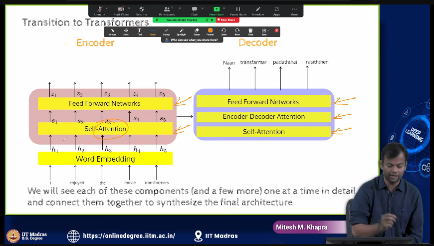
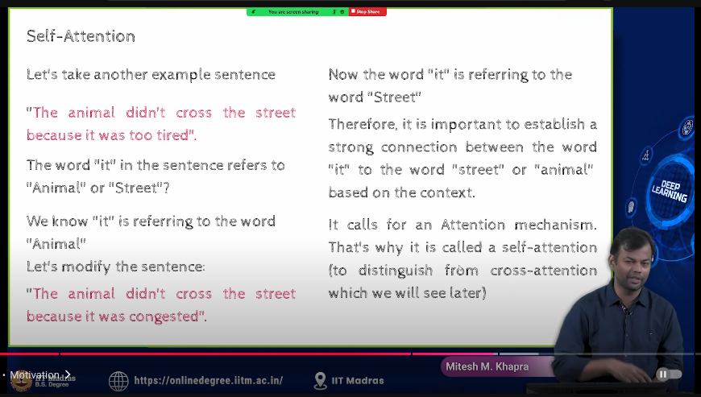

# Attention is all you need

- The problem with RNNs and LSTMs is that they are sequential models. They process one token at a time, which makes them slow and inefficient.
- in attention based encoder-decoder model, the encoder processes the input sequence and produces a set of encoder states. The decoder uses these states to generate the output sequence.

- Transformers are a type of attention-based model that can process the entire input sequence in parallel, making them much faster than RNNs and LSTMs.
    - it is again an encoder-decoder model, but it uses self-attention mechanisms to capture long-range dependencies in the input sequence.
- 

- self attention means that the model attends to different parts of the `input sequence` or `encoder` to generate the output sequence.
- in cross attention, is the attention mechanism between the encoder and decoder. The decoder attends to the encoder states to generate the output sequence.