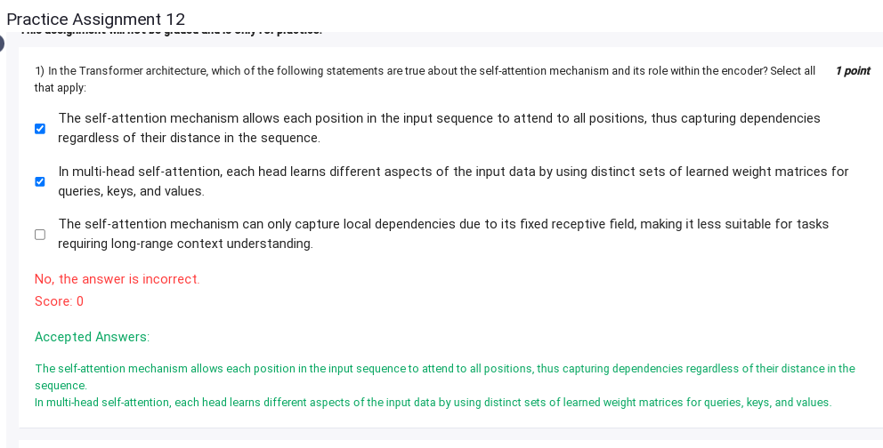
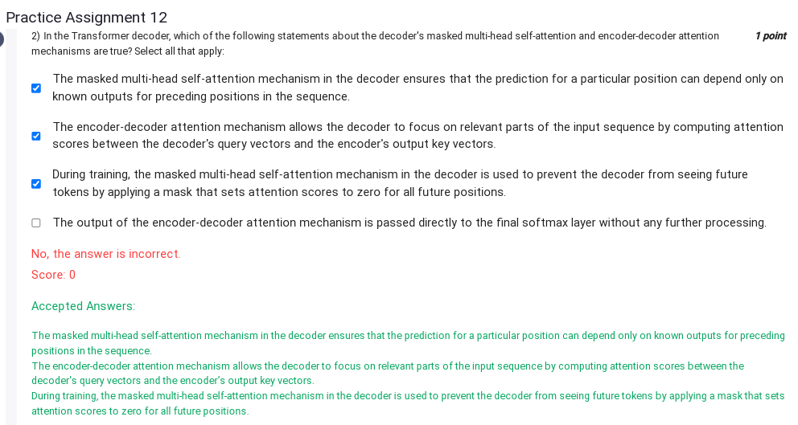
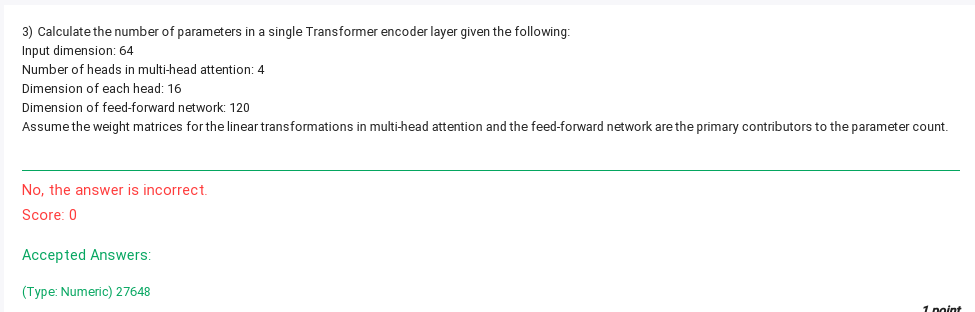
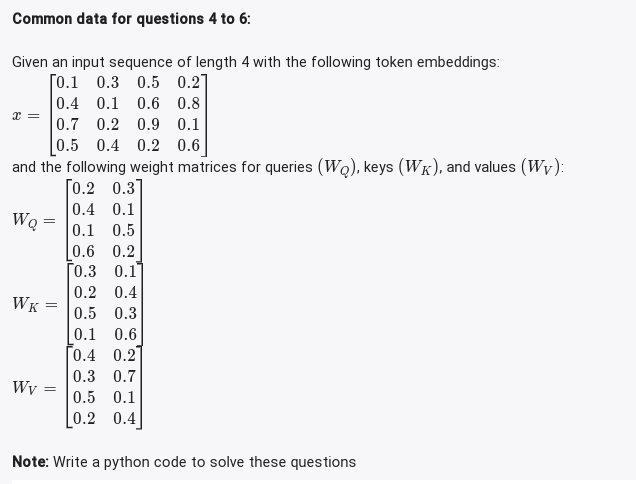
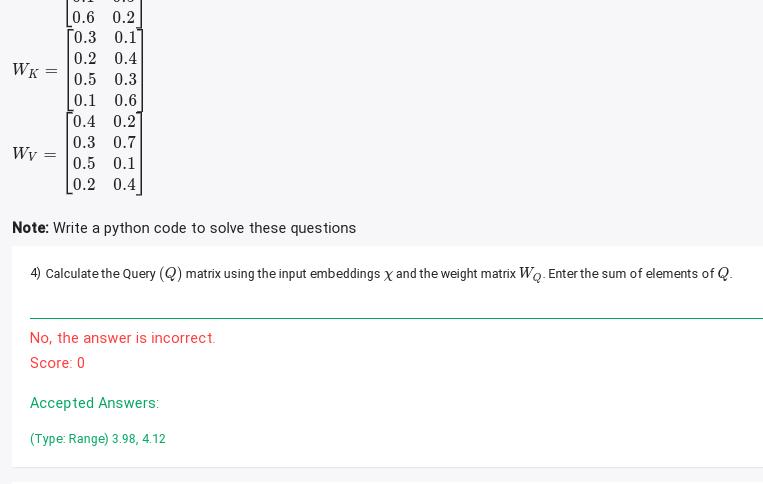
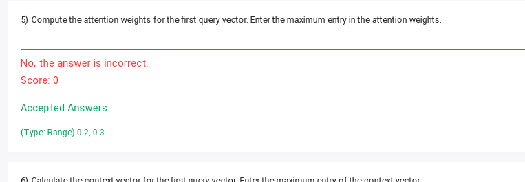
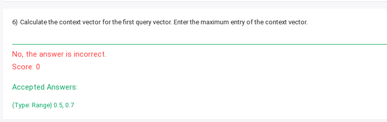

# PA 12)

# 1)


# 2) 

### Correct Statements:

1. **The masked multi-head self-attention mechanism in the decoder ensures that the prediction for a particular position can depend only on known outputs for preceding positions in the sequence.**  
   **True:** This is achieved by applying a causal mask to prevent the decoder from attending to future positions.

2. **The encoder-decoder attention mechanism allows the decoder to focus on relevant parts of the input sequence by computing attention scores between the decoder's query vectors and the encoder's output key vectors.**  
   **True:** This mechanism enables the decoder to align its current state with relevant information from the encoder's output.

3. **During training, the masked multi-head self-attention mechanism in the decoder is used to prevent the decoder from seeing future tokens by applying a mask that sets attention scores to zero for all future positions.**  
   **True:** This masking ensures the autoregressive property required for training sequence models.

---

### Why the Last Option is Incorrect:

**The output of the encoder-decoder attention mechanism is passed directly to the final softmax layer without any further processing.**  
**False:** 

- The output of the encoder-decoder attention mechanism is **not passed directly to the final softmax layer**. Instead, it undergoes further processing.
- Typically, it is combined with the output of the masked multi-head self-attention and fed into a feed-forward network (FFN). These outputs are passed through layer normalization and residual connections as part of the Transformer architecture.
- The final softmax layer only receives processed outputs from the final decoder layer after all attention and feed-forward mechanisms have been applied.


# 3)

Let's calculate the number of parameters in a single Transformer encoder layer step by step:

### 1. Multi-head Attention
- **Input dimension (d_model):** \( 64 \)
- **Number of heads:** \( 4 \)
- **Dimension of each head:** \( 16 \)

For multi-head attention, there are three linear transformations (query, key, value) for each head and one for the concatenated output:

#### Query, Key, and Value Matrices:
Each of these transformations has a weight matrix of shape \( d_{\text{model}} \times d_{\text{head}} \), where \( d_{\text{head}} = 16 \). Since there are 4 heads, the total weight for each transformation is:
\[
64 \times 16 = 1024 \quad \text{(for one head)}
\]
\[
1024 \times 4 = 4096 \quad \text{(for all heads)}
\]

For three transformations (query, key, value):
\[
3 \times 4096 = 12288
\]

#### Output Transformation:
After concatenating the outputs of all heads, we transform them back to \( d_{\text{model}} \). The weight matrix for this transformation is:
\[
d_{\text{head}} \times \text{number of heads} \times d_{\text{model}} = 64 \times 64 = 4096
\]

Total parameters for multi-head attention:
\[
12288 + 4096 = 16384
\]

### 2. Feed-Forward Network (FFN)
The feed-forward network consists of two linear layers:
1. First layer: \( d_{\text{model}} \times \text{hidden dimension} \)
   \[
   64 \times 120 = 7680
   \]
2. Second layer: \( \text{hidden dimension} \times d_{\text{model}} \)
   \[
   120 \times 64 = 7680
   \]

Total parameters for FFN:
\[
7680 + 7680 = 15360
\]

### 3. Total Parameters
The total parameters in the Transformer encoder layer are:
\[
16384 \, (\text{multi-head attention}) + 15360 \, (\text{FFN}) = 27648
\]

**Final Answer: \( 27648 \)**

# 4)


```python
import numpy as np

# Input embeddings x
x = np.array([
    [0.1, 0.3, 0.5, 0.2],
    [0.4, 0.1, 0.6, 0.8],
    [0.7, 0.2, 0.9, 0.1],
    [0.5, 0.4, 0.2, 0.6]
])

# Weight matrix W_Q
W_Q = np.array([
    [0.2, 0.3, 0.4, 0.1],
    [0.1, 0.5, 0.6, 0.2]
])

# Calculate Q = x @ W_Q.T
Q = np.dot(x, W_Q.T)

# Calculate the sum of elements of Q
sum_Q = np.sum(Q)
print(sum_Q)
# Ans : 4.02    
```

# 5)

```python
# Weight matrix W_K
W_K = np.array([
    [0.3, 0.1, 0.2, 0.4],
    [0.5, 0.3, 0.1, 0.6]
])

# Calculate K = x @ W_K.T
K = np.dot(x, W_K.T)

# Compute attention scores for the first query vector
query_vector = Q[0]  # First query vector
attention_scores = np.dot(K, query_vector)

# Apply softmax to obtain attention weights
attention_weights = np.exp(attention_scores) / np.sum(np.exp(attention_scores))

# Find the maximum entry in the attention weights
max_attention_weight = np.max(attention_weights)
max_attention_weight
# Ans : 0.28
```


# 6)


```python
import numpy as np

x = np.array([
    [0.1, 0.3, 0.5, 0.2],
    [0.4, 0.1, 0.6, 0.8],
    [0.7, 0.2, 0.9, 0.1],
    [0.5, 0.4, 0.2, 0.6]
])
# Corrected weight matrices from the image
W_Q = np.array([
    [0.2, 0.3],
    [0.4, 0.1],
    [0.1, 0.5],
    [0.6, 0.2]
])

W_K = np.array([
    [0.2, 0.4],
    [0.5, 0.3],
    [0.1, 0.6],
    [0.3, 0.1]
])

W_V = np.array([
    [0.4, 0.2],
    [0.3, 0.7],
    [0.5, 0.1],
    [0.2, 0.4]
])

# Recalculate Q, K, and V with corrected W_Q, W_K, and W_V
Q = np.dot(x, W_Q)  # Q = x @ W_Q
K = np.dot(x, W_K)  # K = x @ W_K
V = np.dot(x, W_V)  # V = x @ W_V

# Compute attention scores for the first query vector
query_vector = Q[0]  # First query vector
attention_scores = np.dot(K, query_vector)

# Apply softmax to obtain attention weights
attention_weights = np.exp(attention_scores) / np.sum(np.exp(attention_scores))

# Calculate the context vector for the first query vector
context_vector = np.dot(attention_weights, V)

# Find the maximum entry in the context vector
max_context_entry = np.max(context_vector)
print(max_context_entry)

```