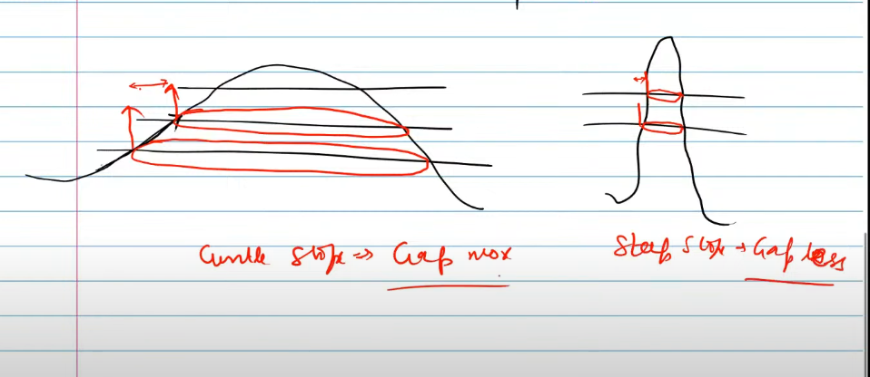
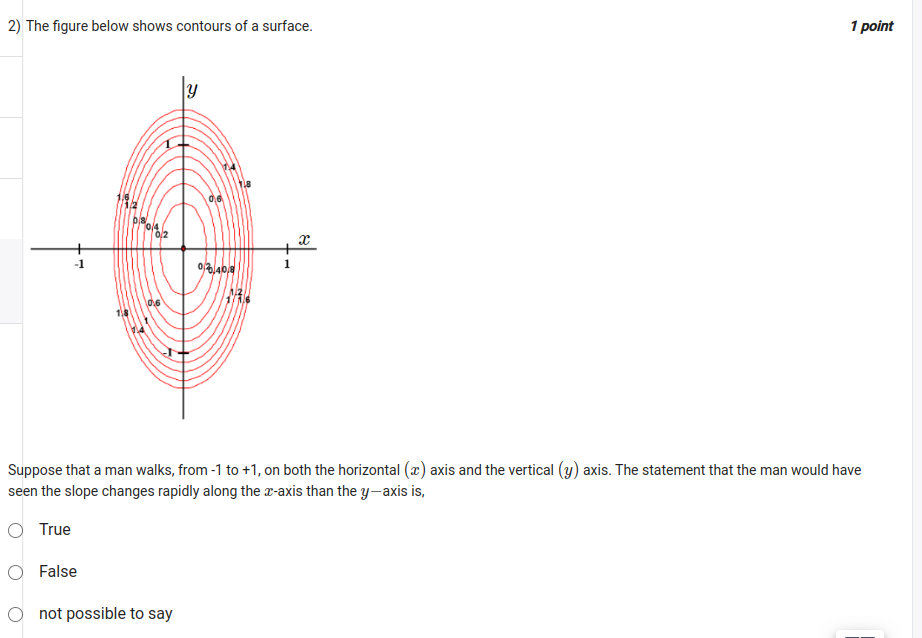

- https://youtu.be/umTHTstJlhM?t=424

- what are contour plots?
    - Contour plots are graphical representations of 3D surfaces on a 2D plane. They are used to visualize the relationship between three variables.
- what do contour lines represent?
    - Contour lines represent points of equal slope value on a surface.
- how do you determine the steepness of a slope from a contour plot?
    - `The closer the contour lines are to each other, the steeper the slope in that region.`
    - closer plots , so more changes, hard to climb, so steeper slope
    - Conversely,` if the contour lines are farther apart, the slope is gentler.`

- `our understandings` - INFERENCE
1)  if the man walks on x-axis from -1 to +1, we can see that at the start the lines are closer and at the middle the lines are farther apart
    - meaning that the slope is steeper at the start and gentler at the middle

2) if the man walks on y-axis from -1 to +1, we can see that at the start the lines are closer and at the middle the lines are farther apart
    - meaning that the slope is steeper at the start and gentler at the middle

- WRT the question, the contours start for x axis at -0.7 and for y-axis at -1.4 
    - this means that along x-axis, the slope is steeper than along y-axis

- hence the statement `The statement that the man would have seen the slope changes rapidly along the 
x
x-axis than the 
y
−
y−axis is,
`
    - `True`