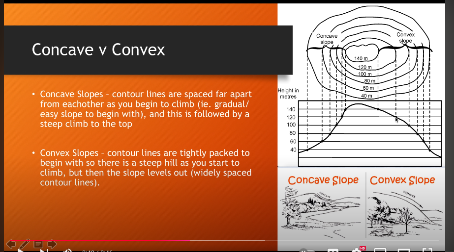
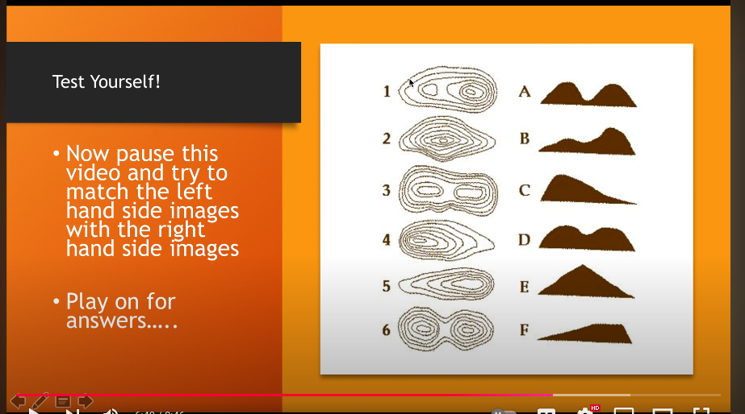

- https://youtu.be/umTHTstJlhM?t=640

- https://youtu.be/K7gV6KvJUdI

how to find out if this is a convex or a concave function?
    - if the slope is increasing, then it is a convex function

- the numbers on the screen are the slope values
    - along y axis the values are decreasing, means the slope is decreasing, so you are going down
    - if the smalle r circle has lower value, then the slope is decreasing, hence it convex

- 

- height difference makes us to cut the , imagine you take a disk and cut at certain heights, then you get the contour plot

- convex -> at start great distance between the circles and eventually it will reduce to closer circles
- concave -> closer circles at the start and eventually it will increase to greater distance between the circles

- 

- this is for test
- 1 - B
- 2 - E
- 3 - D
- 4 - C
- 5 - F
- 6 - A