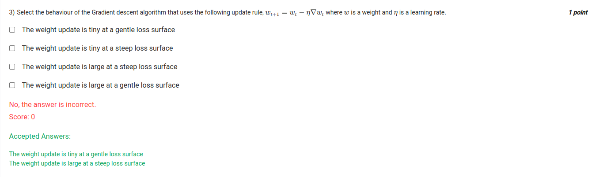

- Gradient descent
    - update rule, wt+1 = wt - learning_rate * gradient

- The weight update is tiny at a gentle loss surface
- `true`
The weight update is tiny at a steep loss surface
-   `false`

The weight update is large at a steep loss surface
- `true`
The weight update is large at a gentle loss surface
- `false`

- in gentle slope, the gradient is small, so the weight update is small