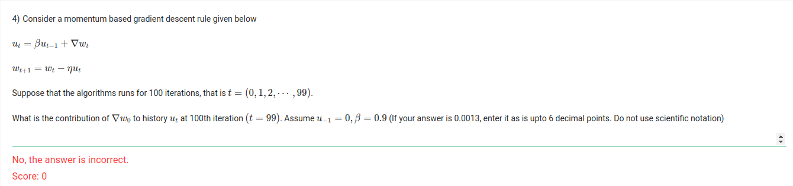

Consider a momentum based gradient descent rule given below

- ut = beta*ut-1 + gradient
- wt+1= wt - learning_rate * ut

where ut is the momentum term, beta is the momentum factor, gradient is the gradient of the loss function, wt is the weight at time t, and learning_rate is the learning rate.

- 