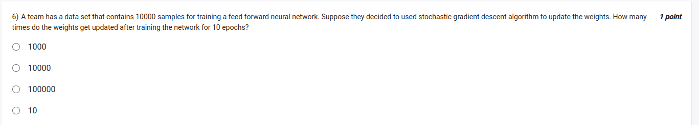
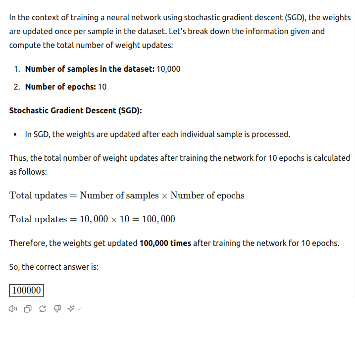

https://youtu.be/umTHTstJlhM?t=1519

- BGD: Batch Gradient Descent
    - where we calculate the gradient of the loss function w.r.t all the samples in the dataset
    - and then update the weights
- SGD: Stochastic Gradient Descent
    - where we calculate the gradient of the loss function w.r.t one sample at a time
    - and then update the weights
- MBGD: Mini Batch Gradient Descent
    - where we calculate the gradient of the loss function w.r.t a subset of the samples in the dataset
    - and then update the weights

- epoch 
    - one pass through the entire dataset
- step
    - one pass through the dataset  (in BGD)
    - one pass through one sample (in SGD)
    - one pass through a subset of the samples (in MBGD)