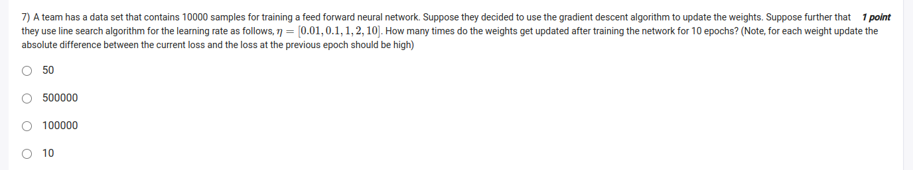
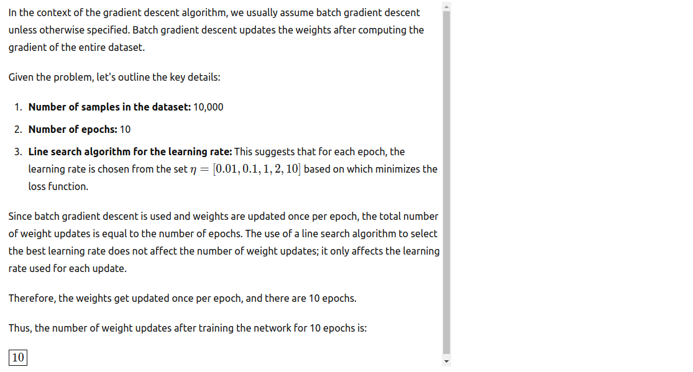

- in line search we find the best learning rate, so we don't need to worry about the learning rate

- line search is computationally expensive, so we don't use it in practice 

- since learning rate is a hyperparameter, we can tune it using grid search, but if we fix it 

- so in line search, we plug in the learning rate and find the best learning rate for the current iteration with lowest loss