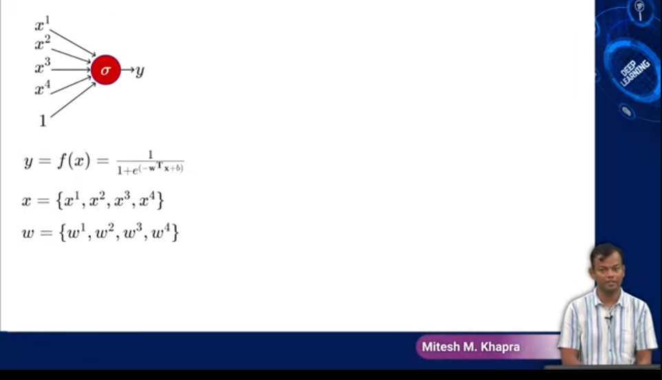
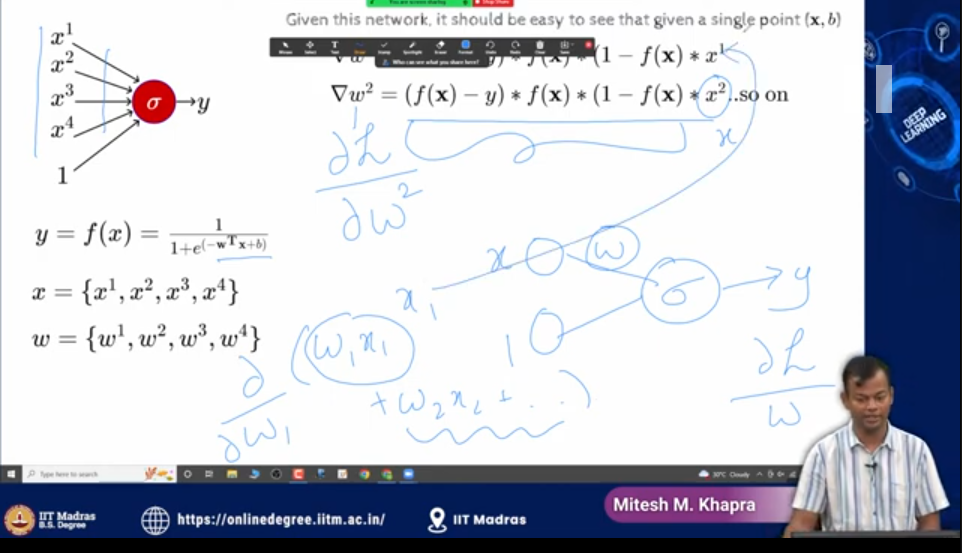
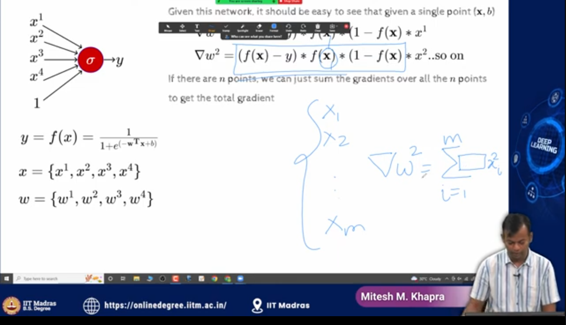
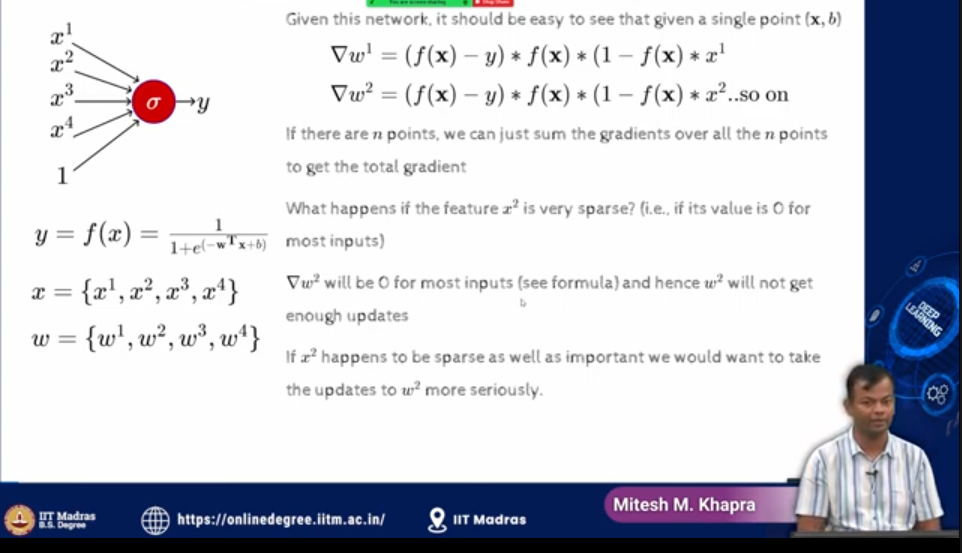
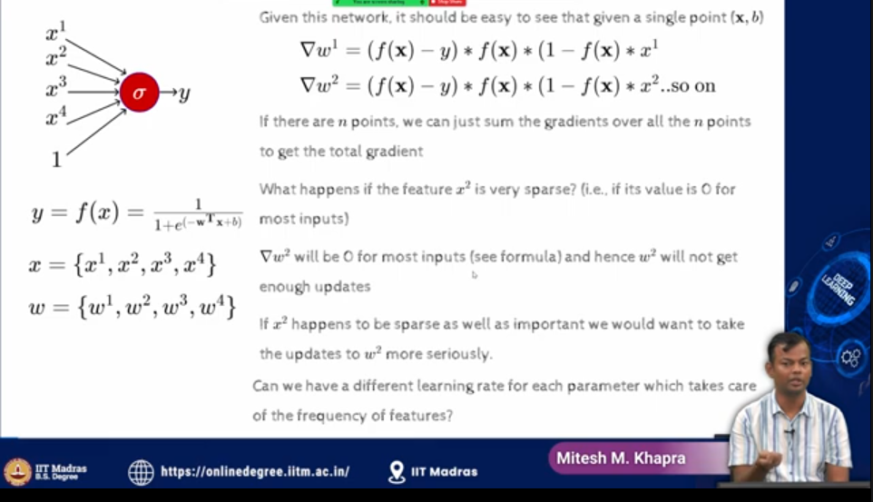

## Minute 1

- so we are in on this journey of looking
at `different variants of gradient
descent`
-  and we looked at quite a few of
them in the last lecture and the main
`takeaways was the idea of momentum and
then how do you correct for momentum
because momentum often takes you very
fast` so the correction was done through
`nestrov accelerated gradient descent` 
- and then we saw the `stochastic and the mini
batch versions ` of these algorithms and
also talked a bit about `how do you come
up with learning rate schedules` right
and during the discussion 
- at some point `we felt the need for like an Adaptive
learning rate right so when you are on
the Steep regions you want the learning
rate to be small and when you are on the
gentle regions you want the learning
rate to be fast` right so that's what I
## Minute 2
mean by adaptive so it should look at
okay how is the history been and where
am I currently and `can I accordingly
slow down or maybe speed up a bit` right
and the `gradients will of course not
change ` if you are in the `Steep region
they will be large and if you're in the
general region they will be small` right
you `can't do much with the gradients` but
then the `multiplying factor which is the
learning rate can you change that so
that you can scale up and scale down the
updates accordingly` right so uh that's
the idea that we want to explore in
today's lecture right so let's first

again make a case for it so here's again
a `simple neural network
there's a slight change in notation
which I had to do because now `we have
four inputs so it's not a change in
notation just a new notation so we have
these four inputs so far we have been
dealing with a simple neural network
where we had one input one bias and then
the output I'm looking at four inputs X1
X2 X3 X4 and then the bias which is a
constant input of 1` and of course each
## Minute 3
of these inputs has an `Associated weight
W1 W2 w3w4` right `so we have been using
the subscript for the training instance`
so there are `M training instances X1 to
xn which is X is bold which is a vector
but now we have these superscripts for
the different uh inputs within a given
training instance right so now you could
think of X as in X as a vector
X1 X2
X3
X4 and this is one input` right so let's
say this is the data about one movie and
there would be many such movies so say
this is the movie one so then we have x
1 1 x 1 2 x 1 3 x 1 4. right so that's
the notation that we are using so these
are all the individual inputs that are
going to the network and a collection of
such inputs forms one training point or
Minute 4

one uh data point right so that's the
idea okay uh and so this is the notation
and now uh so we have multiple weights
now right we have W and W2 w3w4 and for
the minute I have ignored the bias so
now given this network that it should be
easy that for a given a single data
point right which is uh X and it should
have been X comma y not X comma B sorry
this should have been y so a single
training point is the input X and the
output y now if you wanted the
derivative of the loss function with
respect to W1 which is one of the
weights in this network right so
remember earlier we had derived when we
just had one weight w we had derived
this quantity which was the derivative
of the loss function with respect to uh
W and this is the formula that we had
got and the only thing that has changed
is that that time we had only one input
which was X now we have four inputs X
One X two x three x four so if you
derive the formula this part which I
Minute 5

have the under braces that would remain
the same and it would just get
multiplied by the appropriate input
right the input to which the weight uh
corresponds to similarly for the second
weight W2 the derivative of the loss
function with respect to the weight
right so this would be uh so this
quantity here is derivative of the loss
function with respect to the weight W2
and if you solve for that you will get
this is the answer and this is not very
different from what we had already done
right so we had this network earlier
which was uh
a single input
x 1 and then you had this com constant
one and in this case when we had taken
the loss function and then computed the
derivative of the loss function with
respect to this weight the formula that
we had got was this multiplied by the
corresponding input which is X right and
all I'm saying is that now if you have
four different inputs and four different
weights associated with each of those
inputs then if you take the derivative
Minute 6

with respect to any of these weights the
formula will not change only the last X
will get replaced by the appropriate X
right so you can go and check this but
it should also be straightforward
because you have this W transpose X here
which is W1 X1 plus W2 X2 and so on so
when you take the derivative of this
quantity right so finally when you apply
the chain rule at some point you will
take the derivative of this quantity
with respect to W1 and all the other
quantities will disappear and the
derivative of this quantity would be X1
right so that's how this X1 is showing
up here right so that's the idea
so if there are end points we can just
sum the gradients over all the endpoints
to get the total gradient right so what
does that mean that this was with
respect to a single point where the
input was 1X but I could have inputs
which are
X1
x 2 all the way up to x m right so here
Minute 7

I have shown the derivative with respect
to one such input but if you have many
inputs then you will just sum the
derivative across all these inputs at
this we have again done some before so
the the derivative of w derivative of
the loss function that will secure W 2
would be summation
I equal to 1 to M right and then uh you
will have this entire quantity inside
and
in the end that would be multiplied by
x 2 of the appropriate I right so that's
what the derivative would look like
right so uh maybe this is not clear here
let me just undo that
yeah so you'll have this
so you'll have this term which is in the
bracket and then multiplied by x 2 of
Minute 8

the corresponding input right so that's
what the total derivative would look
like right so you're just the derivative
of the loss function with respect to W2
is going to the sum of this quantity
that I have shown here okay now
now what happens if a feature X2 is
passed right so X2 is one of the
features so in our oil drilling example
it could be salinity pressure
temperature Etc in our movie example it
could be the director actor and so on
right now if one of these features is
sparse what does that mean that across
all the M training points that I had
happen this feature is always in many
cases is going to be 0 right in a
classic example for this would be if I
have data for the past say 1000
Bollywood movies right and if I have one
of the features as is actor Amir Khan
now Amir Khan acts in very few movies so
for these thousand movies maybe there
would be four to five movies for which
this feature is on and everywhere else
this feature would be zero right so
that's what a sparse feature looks like
Minute 9

and again as you can imagine in real
world applications there are many
features which are sparse now what's the
consequence of that right so if my
derivative
formula that I just showed you as the
sum right is summation
I equal to 1 to M then that quantity
that I just mentioned multiplied by
this feature value right this is what my
derivative is
going to be
right and now if this feature is very
sparse that means when I am taking the
sum for if this m is equal to thousand
and out of 1000 times if 990 times this
feature is going to be 0 then 990 terms
in this derivative are going to be 0
right that means my total derivative
that I am going to compute is going to
be very sparse for features uh is going
to be very small for weights
corresponding to sparse features now
what's the consequence of that the
consequence consequence of that is that
Minute 10

in my any gradient descent based update
my new weight is going to be my old
weight right so let me just call this
new
and this old minus ETA times whatever
derivative I compute and I've just told
you that if X is sparse or that feature
is pass then the derivative is going to
be small and if the derivative is going
to be small then it means that my
updates are going to be small and if my
updates are going to be small then I'm
not making much changes along that
direction right and that is not
something that I desire right and now a
wish list here would be that if I know
my derivatives are going to be small can
my learning rate would have been high
for such sparse features so if the
learning rate would have been high then
still my updates would have been larger
right so this is one more case for
having an Adaptive learning rate so we
talked about two cases one is in the
Steep regions I want the learning rate
to adopt and in the flat regions again I
wanted to increase and the Steep regions
I wanted to be small the other cases

