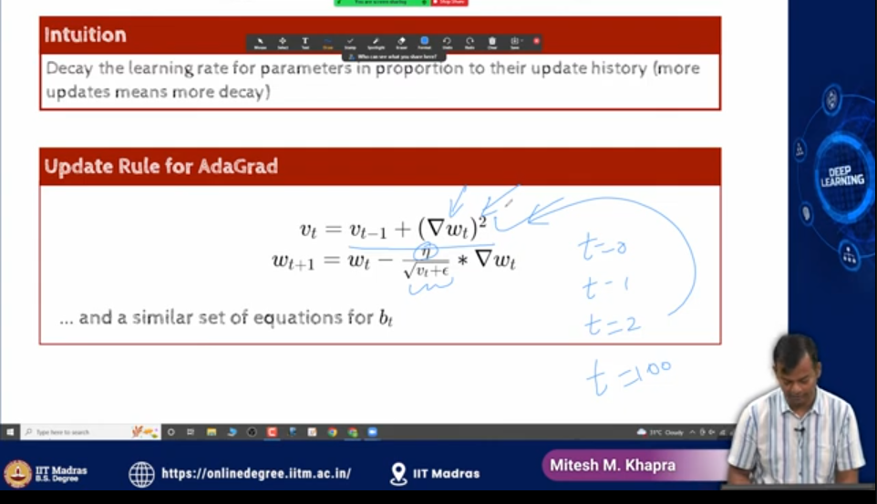
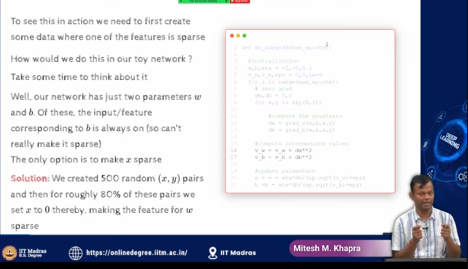
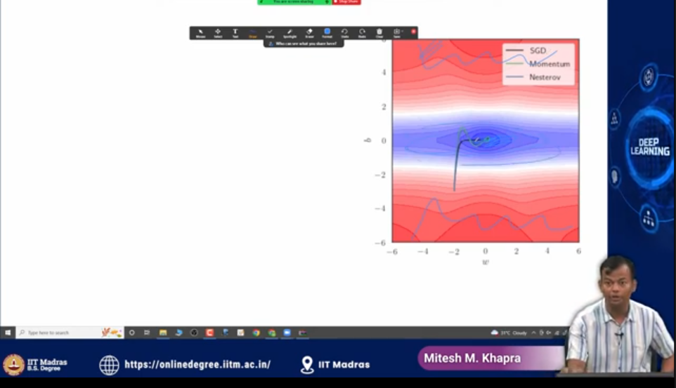
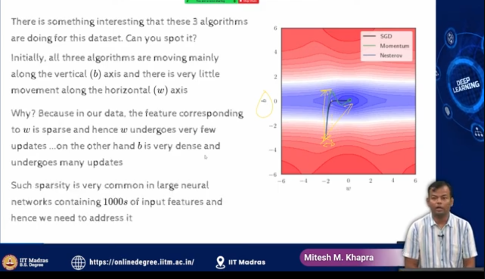
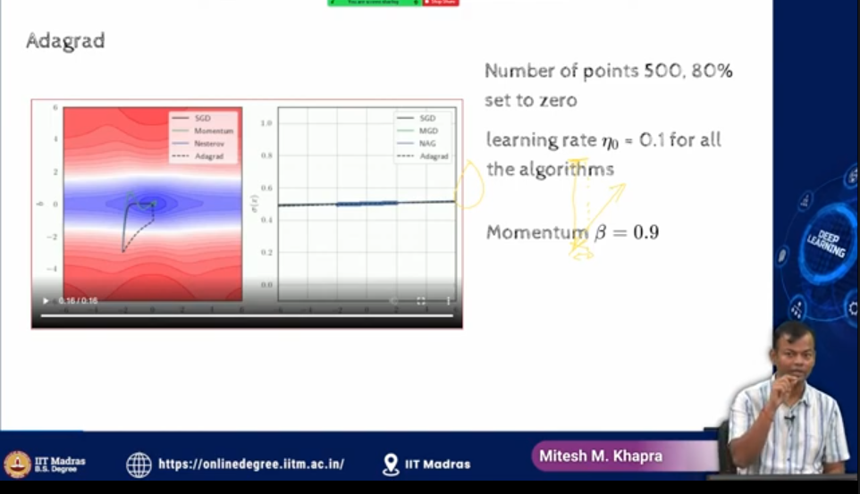
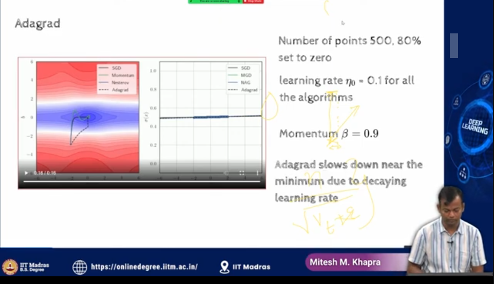
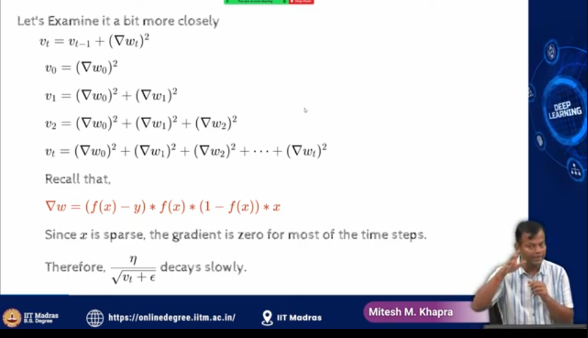
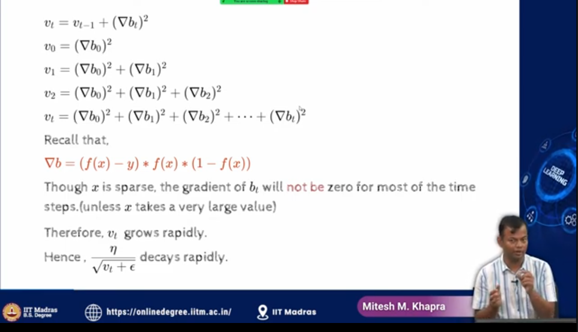

- Red high loss
- large diff between contour lines, so it means that it is a flat region

- blue low loss
- x is `w`
- y is `b`

- b was dence hence gradient descent was larger,hence large movement in b

