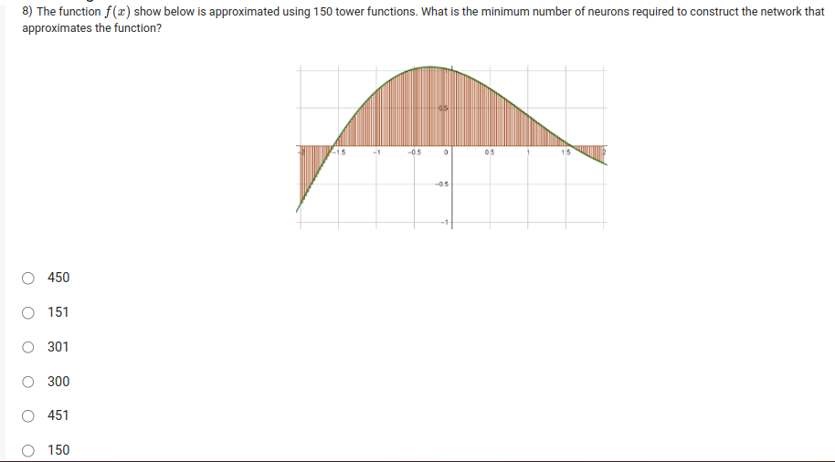
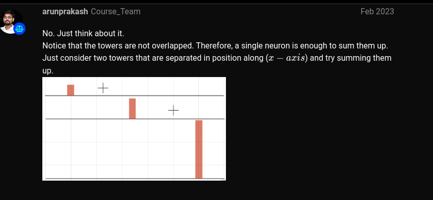

Thank you for the clarification! Here's an explanation of why the correct answer is 301:

In the case of neural networks, particularly those using "tower functions" or basis functions, each of these tower functions corresponds to a neuron in the hidden layer of a feedforward network. However, if the function requires 150 tower functions for approximation, the reasoning might follow that:

1. For each tower function, there could be one corresponding neuron in the hidden layer, and typically you would need a layer for both positive and negative parts of the function, or a sufficient number of neurons to model more complex aspects of the function (such as non-linearity).
   
2. The number 301 may come from having **150 neurons for positive parts** and **150 neurons for negative parts** (or a second set of neurons to capture more intricate function details), plus **1 bias neuron** for better approximation, which totals to 301.

In this case, the answer is 301 because the neural network might need more neurons than just the 150 tower functions due to the structure of the network, often doubling the number of neurons for proper modeling and adding one for the bias.

Thanks again for the correction!

- we will create all the towers , and sum them up to get the final output