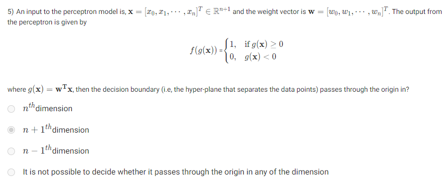

To determine the threshold value of an MP (McCulloch-Pitts) neuron that implements the AND Boolean function with 10 inputs, we need to understand how the MP neuron works.

- The MP neuron activates (outputs 1) if the sum of its input signals exceeds or equals the threshold value.
- For an AND function, the neuron should only activate when **all** 10 inputs are 1. 

Therefore, the threshold must be equal to the number of inputs (which is 10). If all inputs are 1, their sum will be 10, and the neuron should activate. For any fewer inputs being 1, the sum will be less than 10, and the neuron should not activate.

Thus, the correct threshold value to implement the AND Boolean function is **10**.

---

The diagram and description provided define an MP (McCulloch-Pitts) neuron where the function \( g \) is composed of both excitatory and inhibitory inputs. Let's break down the components to answer the question about how many inputs are inhibitory:

### Function \( g \):
\[
g(x_1, x_2, \dots, x_m) = \left( \sum_{i=1}^{n} x_i \right) \cdot \prod_{j=n+1}^{m} (1 - x_j)
\]

- The first part, \( \sum_{i=1}^{n} x_i \), sums the first \( n \) inputs, suggesting that these are **excitatory** inputs.
- The second part, \( \prod_{j=n+1}^{m} (1 - x_j) \), multiplies the negation of inputs \( x_{n+1} \) to \( x_m \), suggesting that these are **inhibitory** inputs. If any of these inhibitory inputs are 1, the product becomes 0 (since \( 1 - 1 = 0 \)), which cancels out the effect of the excitatory part.

### Output function \( f(g(x)) \):
The output is:
\[
f(g(x)) = \begin{cases} 
1, & \text{if } g(x) \geq \theta \\
0, & \text{if } g(x) < \theta 
\end{cases}
\]
Where \( \theta \) is a positive threshold value.

### Question: How many inputs are inhibitory?

From the function \( g(x) \), the inhibitory inputs are in the product term \( \prod_{j=n+1}^{m} (1 - x_j) \), which involves inputs from \( x_{n+1} \) to \( x_m \). Therefore, the number of inhibitory inputs is \( m - n \).

In summary:
- **Number of inhibitory inputs**: \( m - n \).
---

The diagram shows an implementation of a Boolean function using three logical AND gates for four inputs \( x_1, x_2, x_3, x_4 \).

### Boolean function breakdown:
- The first AND gate computes \( x_1 and x_2 \).
- The second AND gate computes \( (x_1 and x_2) and x_3 \).
- The third AND gate computes \( ((x_1 and x_2) and x_3) and x_4 \), which gives the final output \( y \).

This is essentially an AND function of all four inputs, so the function being implemented is:
\[
y = x_1 and x_2 and x_3 and x_4
\]

### Minimum number of MP neurons required:
An MP neuron can implement the AND function with a single neuron by setting a threshold value equal to the number of inputs. Since all inputs are excitatory, a single MP neuron with a threshold of 4 would output 1 if and only if all inputs \( x_1, x_2, x_3, x_4 \) are 1.

Thus, only **1 MP neuron** is required to implement this Boolean function, as it can handle all four inputs at once.

### Answer:
The minimum number of MP neurons required is **1**.

---

When \( n = 0 \), the Boolean function maps the empty set (i.e., no inputs) to either 0 or 1. Essentially, the function is defined over an empty set, which means it has no variables to process.

However, even with no inputs, a Boolean function still has to output either 0 or 1. So, there are two possible outputs: 
- The function could always output 0.
- The function could always output 1.

Thus, there are **2 Boolean functions** when \( n = 0 \), corresponding to the two possible constant outputs (0 or 1).

### Answer: 
There are **2** Boolean functions when \( n = 0 \).

---

We are given a perceptron model where the decision boundary is determined by:

\[
g(x) = w^T x = 0
\]

The input vector \( x = [x_0, x_1, \dots, x_n]^T \in \mathbb{R}^{n+1} \), and the weight vector \( w = [w_0, w_1, \dots, w_n]^T \). The output function is based on the sign of \( g(x) \), and the decision boundary occurs when \( g(x) = 0 \), which defines a hyperplane.

### Analysis of the Decision Boundary:

- The decision boundary separates the input space into two regions: one where \( f(g(x)) = 1 \) and another where \( f(g(x)) = 0 \).
- The boundary is described by the equation \( g(x) = w^T x = 0 \), which is a linear equation in \( n+1 \)-dimensional space (because \( x \in \mathbb{R}^{n+1} \)).
  
For the decision boundary to pass through the origin in this context, it implies that there is no bias term, i.e., \( w_0 = 0 \). This makes the decision boundary a hyperplane in the \( n+1 \)-dimensional input space, meaning the decision boundary lies in the \( n+1 \)-dimensional space.

### Correct Answer:
Since the input vector \( x \in \mathbb{R}^{n+1} \), the decision boundary passes through the origin in the **\( n+1 \)-th dimension**.

---

---

---

---
Let’s clarify the reasoning behind the bias term \( w_0 \) for a perceptron that learns the NAND gate function.

### NAND Gate Truth Table Recap

| \( x_1 \) | \( x_2 \) | Output \( y \) |
|-----------|-----------|-----------------|
|     0     |     0     |        1        |
|     0     |     1     |        1        |
|     1     |     0     |        1        |
|     1     |     1     |        0        |

### Perceptron Model Setup

The output of the perceptron can be defined as:

\[
y = \begin{cases} 
1 & \text{if } w_1 x_1 + w_2 x_2 + w_0 > 0 \\
0 & \text{otherwise}
\end{cases}
\]

### Finding the Weights and Bias

To separate the outputs of the NAND gate correctly, we need to establish the decision boundary:

1. **For \( (0, 0) \):**  
   \[
   w_0 > 0 \quad \text{(because } w_1 \cdot 0 + w_2 \cdot 0 + w_0 > 0\text{)}
   \]

2. **For \( (0, 1) \):**  
   \[
   w_0 + w_2 > 0 \quad \text{(needs to hold true)} 
   \]

3. **For \( (1, 0) \):**  
   \[
   w_0 + w_1 > 0
   \]

4. **For \( (1, 1) \):**  
   \[
   w_1 + w_2 + w_0 \leq 0 \quad \text{(this should be false for output 0)} 
   \]

### Analyzing the Bias Term

To ensure that all combinations except \( (1, 1) \) yield an output of 1 and \( (1, 1) \) yields an output of 0, the bias \( w_0 \) must be:

- **Positive**: This guarantees that the threshold for classification is set correctly to separate the \( (0,0), (0,1), (1,0) \) inputs (which should all yield 1) from the \( (1,1) \) input (which should yield 0).

### Conclusion

Therefore, the correct choice is indeed **positive** for the bias term \( w_0 \) to achieve the desired separation in a NAND gate using a perceptron model. Thank you for your patience, and I hope this explanation clarifies the reasoning!

---

---
---

---
---

---