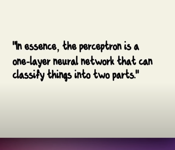
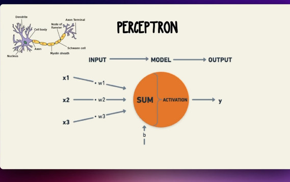
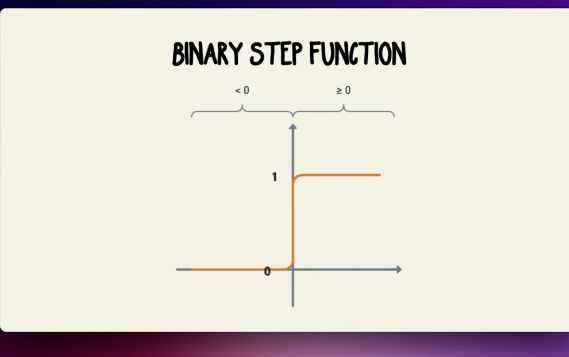
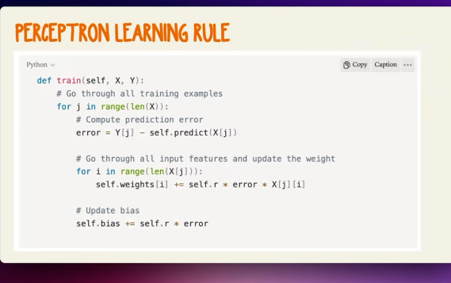

What is perceptron?
    - https://youtu.be/i1G7PXZMnSc
    - perceptron is a simple model of a neuron
    - 
    - 
    - 
    - 

    - Perceptron is called a linear binary classifier
    - it classify input into two classes