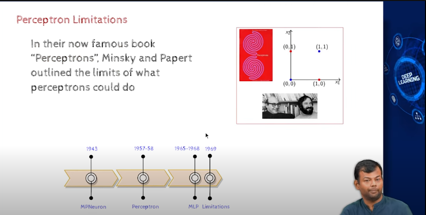

- limitations of Perceptron
- 

- perceptron can mimic any boolean function

- book
    - "Perceptrons" by Minsky and Papert
    - this book showed that perceptrons have limitations

- why do we think that perceptron can model any real world problem or phenomenon? 

- suppose we want to make complex decisions based on multiple inputs
   - y=f(x)  , x belongs to R^n

- claims,
    - given enough input, output pairs, perceptron can learn any function

- but, Minsky and Papert showed that perceptrons have limitations
    - perceptron cannot learn XOR function
    - XOR function is not linearly separable
    - this is in case of only one single perceptron

    - complex functions can be learned by stacking multiple perceptrons