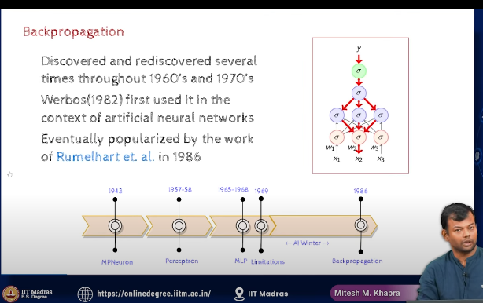

- backpropagation
    - backpropagation is a method used to calculate the gradient of the loss function with respect to the weights of the network.

    - this is the algo that is used to train the DNN even today

    - the heart of BP is the chain rule of calculus and the idea of gradient descent

    - 
