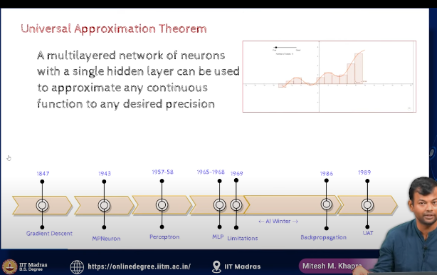

- 

- lets  say f is a function to determine how to hire a person
- x is some example of a person
- have so many examples of people and features of people

- UAT states that  if you have a lot of data, you can use it to train a model to predict the future 

- this states that even if we have a one layer of network with a lot of neurons, we can approximate any function

- all we know was several instance of x and f(x) and we can approximate f(x) using a neural network

- the more neurons we have, the more complex function we can approximate

- this is the universal approximation theorem

- this was a breakthrough in the field of neural networks

## doubt, 

    - one layer means , one layer of neurons or one layer of network?

## answer

Yes, according to the **Universal Approximation Theorem (UAT)**, a **single hidden layer** neural network with a **sufficiently large number of neurons** can approximate any continuous function on a compact subset of \(\mathbb{R}^n\) to any desired degree of accuracy. 

In essence, the UAT suggests that:

- Even with **one hidden layer**, as long as the network has a sufficiently large number of neurons (units) and the right activation function (typically nonlinear, like the sigmoid or ReLU), it can approximate any continuous function.
  
However, the theorem doesn't specify how many neurons are needed or how efficiently the approximation is achieved. In practice, deeper networks (with more than one hidden layer) tend to be more effective at learning complex functions and patterns efficiently.

So, in summary, **one hidden layer with a large number of neurons** can be sufficient according to the UAT, but additional layers may be beneficial in practice.