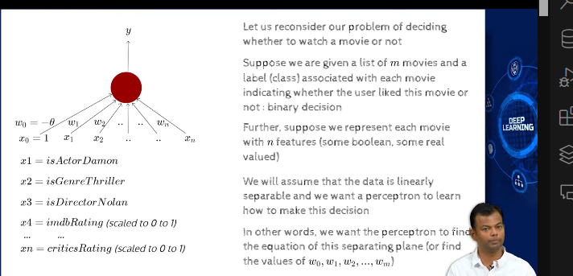

- decision boundary that a perceptron learns is linear

- error
    - if w1, w2 , w3 are  not properly set, then the perceptron will not be able to learn the data
    - it wont be able to divide the data into two classes

- apart from boolean functions? what is perceptron used for?

- whether to watch a movie or not

- 

- P be inputs with label 1 (positive points)
- n be inputs with label 0 (negative points)
- initial weights are random

- convergence = when all the points are classified correctly

- convergence -> if i reach a point , such that the values of w are such that all the points are classified correctly
    - if for all the +ve points, sum w.x > 0
    - if for all the -ve points, sum w.x < 0

- that means we are able to clearly separate the training data

- all positive points will have angles less than 90 degrees
- all negative points will have angles greater than 90 degrees

- will this converge?
    - yes ,if the data is linearly separable