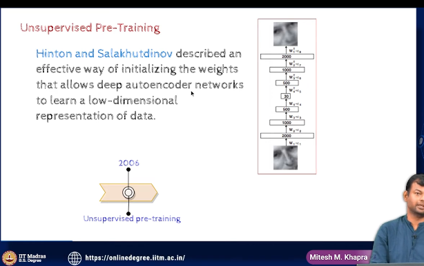

- unsupervised Pre -training

- a simple idea, 
    - if you do something to initialize the weight of the network properly, then the final training will be faster and more accurate and backpropagation will be more effective and stable
    - earlier it was random initialization, but now we use unsupervised pre-training