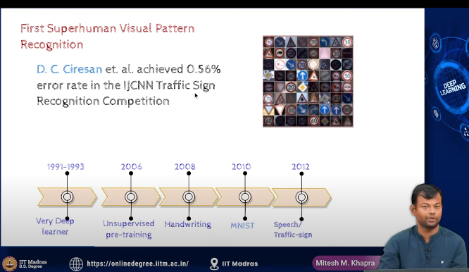

- all these happened due to better initialization

- 
- imagenet challenge
    - 1000 classes of images, like cat, dog, etc
    - 1.2 million images
    - test set of 50,000 images
    - 

    -  3.6 percent is  better than human error rate

    - layers increased , so did the accuracy

- Slowly DNN became popular in NLP, speech recognition, etc