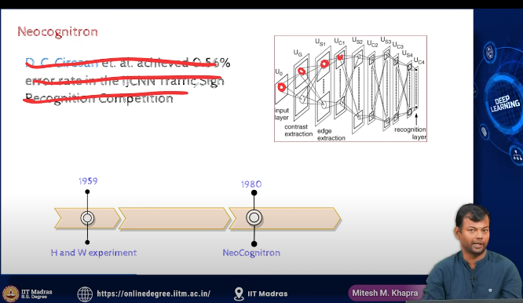

- https://www.youtube.com/watch?v=IOHayh06LJ4&pp=ygUfaHViZWwgYW5kIHdpZXNlbCBjYXQgZXhwZXJpbWVudA%3D%3D

- hubel and wiesel cat experiment

- depending  on where the stick was placed in the visual field of the cat, the neuron would fire differently in different parts of the brain

- distrubuted processing

- this  is the motivation behind CNN

- this is not a fully connected network, instead it is a sparse network