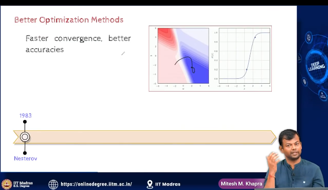

- we know now that we can train DNNs to learn complex functions
- can we try to do this  faster?

- Gradient Descent
- Nestrov Accelerated Gradient
- Adagrad
- RMSprop
- Adam
- NAdam
- AdamW
- RAdam
- AdaBound

- since we have multiple minimas, we need to find the global minima

- learning rate scheduling