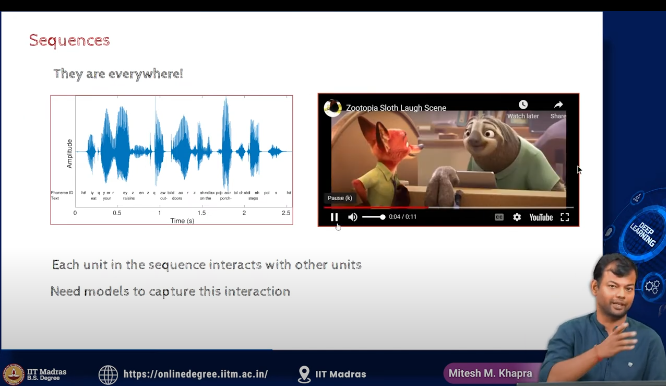

- sequecnces

 - 

 - RNN, 
    - we have a sequence of inputs , and we want some interaction between them 

    - eg when we are talking, we cannot analze every millisecond of the audio, we need to understand the context of the sentence
    - we should understand what we spoke before and what we are speaking now

- Jordan network
    - allowed the output of  one neuron to be fed back to the input of the same neuron or to the input of another neuron

    - sequence of images of a video and we want to do a video classification
    - this is  important in video classification, we need to understand the context of the video

    - 