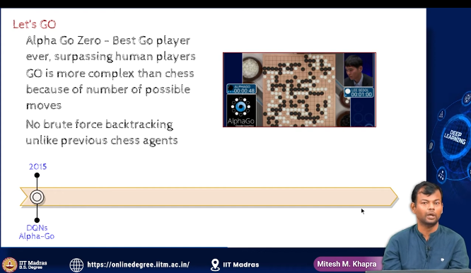
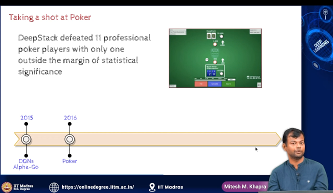
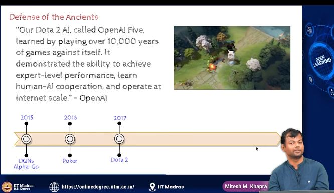
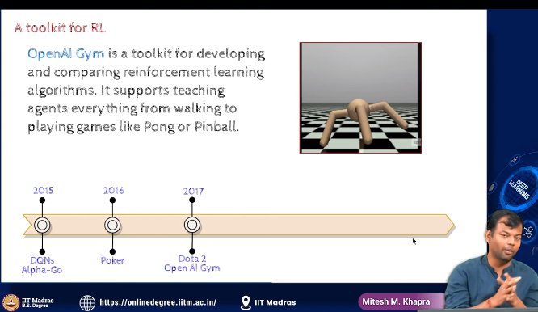
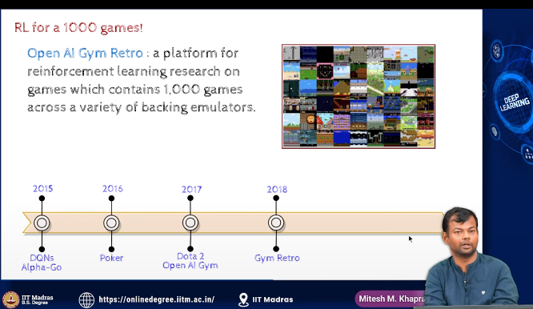
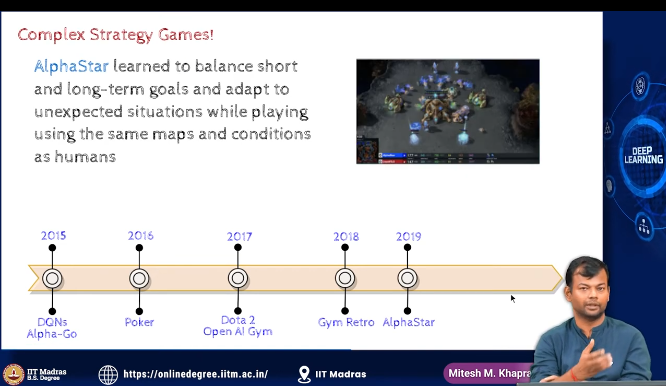
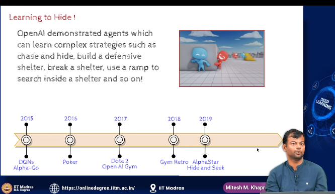
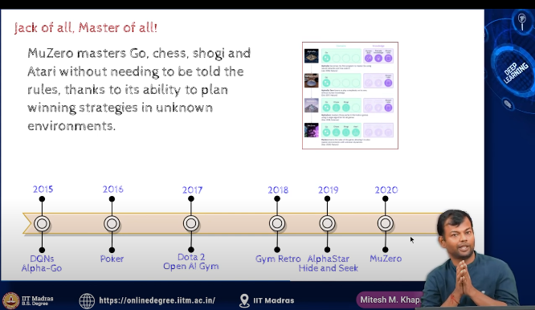

- RL
    - deep reinforcement learning
    - atari games

- 

- 

- 

- while the above  models were good at one area muzero is good at all three areas of RL,
- can play atari games, chess and go
- shogi too