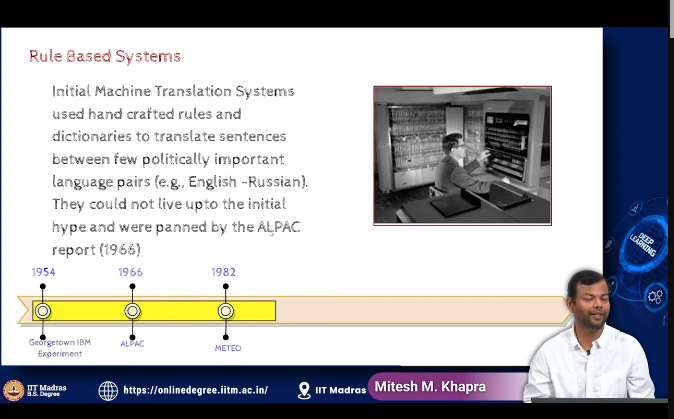
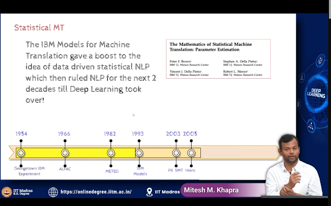
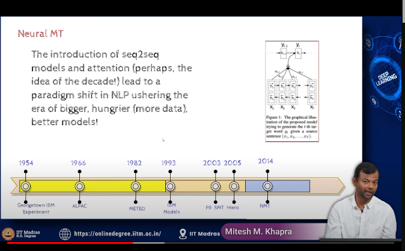
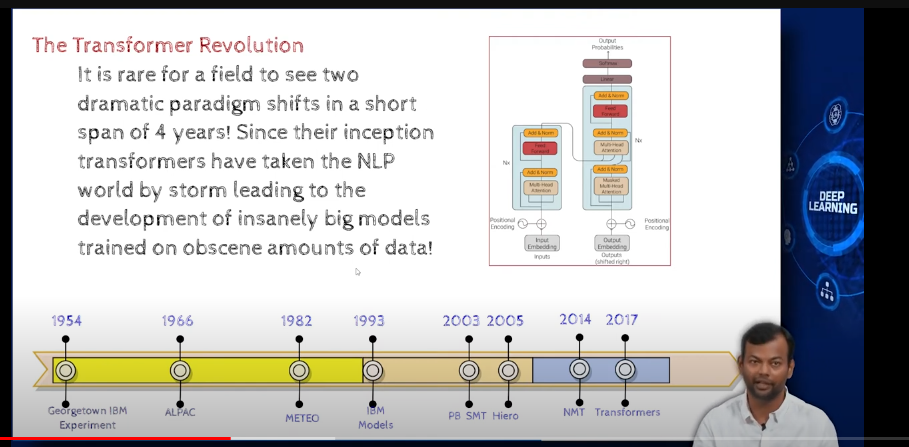
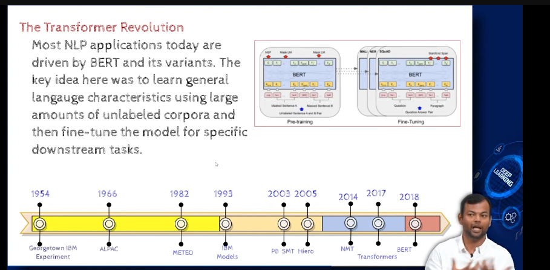
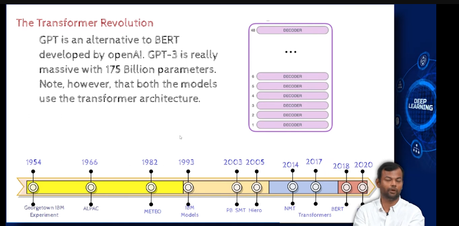

- machine translation
    - means translating a sentence from one language to another

- 

- probability of finding a french sequence , given an english sequence

- attention

- most machine translation models are now based on Transformers

- 

 -BErt model, 
    - learn a language first, then do a task
    - learn language in large amounts using unlabelled data

- 
- GPT is alternative to BERT developed by OpenAI

