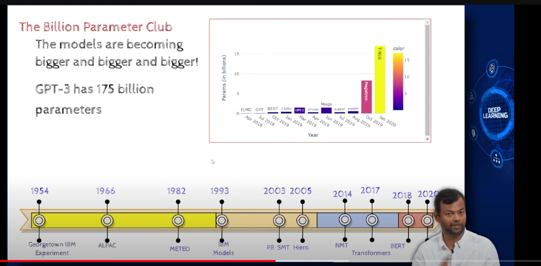
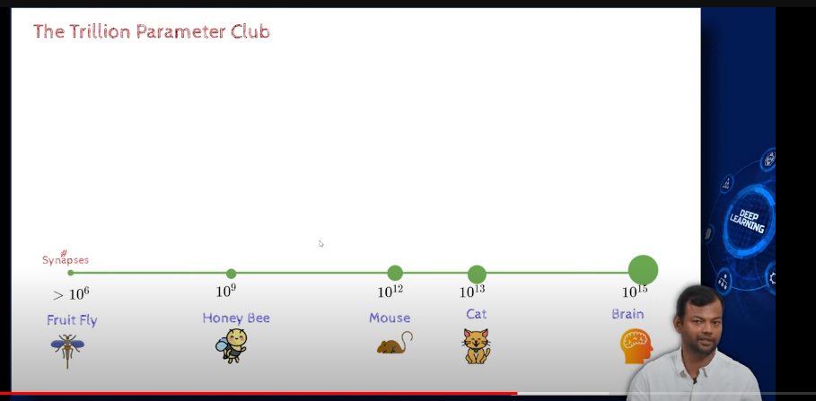
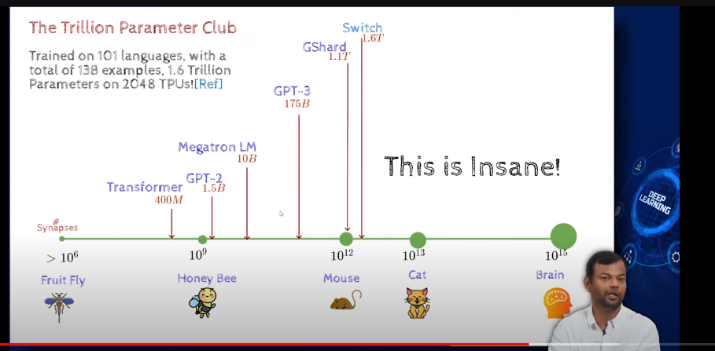

- GPT3 has 175 billion parameters
    - parameters are the weights and biases of the model
    - this shows how complex the model is and how much data it has seen

- our human brain has 10 billion neurons
    - each neuron has 1000 connections
    - this is 10 trillion connections
    - this is 1000 times more than GPT3

- 
- these synapses are the connections between neurons, they are the weights and biases of the brain

