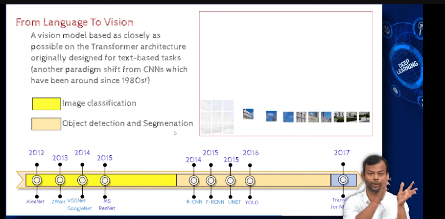
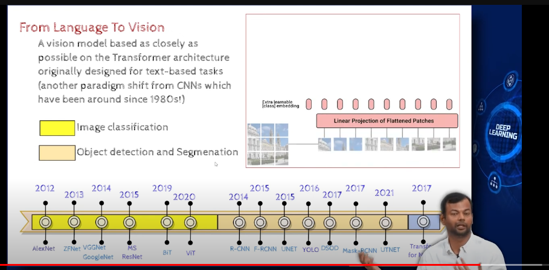
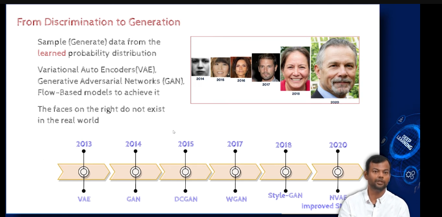
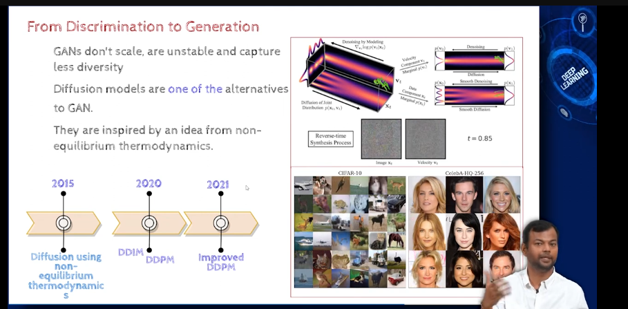
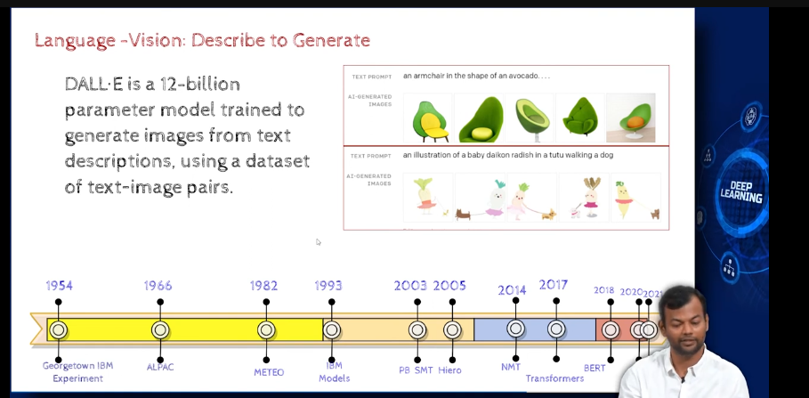
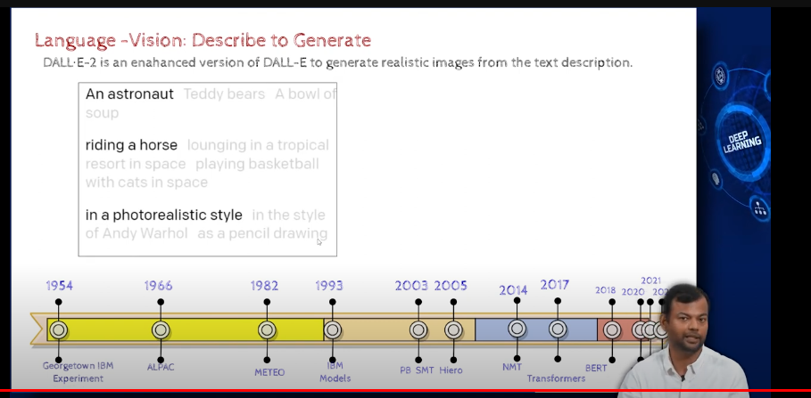

- transformers have also been used in other fields like vision, speech, etc. and replaced RNNs and LSTMs

- 

- generate images

GAN are the most popular models for generating images

-  diffusion based models overcame certain drawbacks of GANs

- 

- Dalle was a transformer based model

- dalle-2  is diffusion based model

- differnce between the two is that dalle-2 can generate images of higher resolution than dalle 

- 