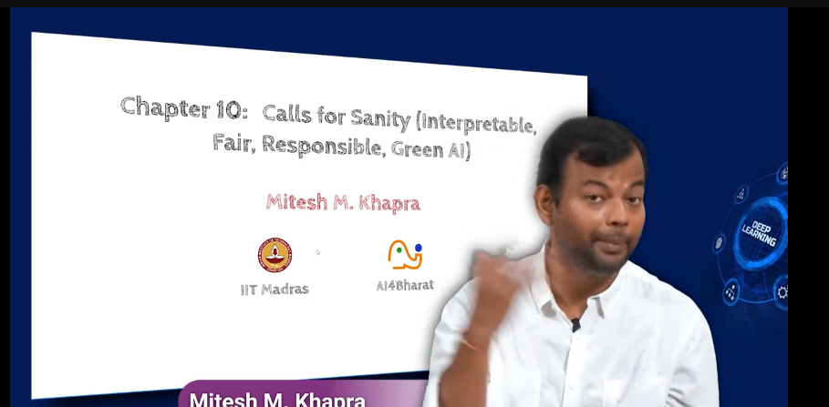

- fair , responsible and green AI
    - fair AI: AI systems that are designed to minimize bias and ensure that they are inclusive and equitable
        - eg; facial recognition systems that are trained on diverse datasets to avoid bias against certain groups of people like black people as thief or criminal
    - responsible AI: AI systems that are designed to be transparent and accountable
        - eg; AI systems that are used in healthcare should be able to explain their decisions and provide evidence for their recommendations
    - green AI: AI systems that are designed to be energy-efficient and environmentally friendly
        - eg; AI systems that are trained on renewable energy sources like solar power or wind power

    - 
        - we cant tell why its make a mistake

- 
    - images  to fool DNN

- 

    - clever hans toolkit to detect bias in AI models
    - to show some adversarial examples like images that are designed to fool DNNs

- 

    - predicting the structure of proteins

    - how you will look like when you are old

    - how galaxy will look like in 100 years
    - different way of doing astronomy

- 

-  https://www.youtube.com/watch?v=KWHXchlJzSw&pp=ygUlZGlzY292ZXJpbmcgc3RhdGUgdmFyaWFibGVzIGhpZGRlbiBpbg%3D%3D

