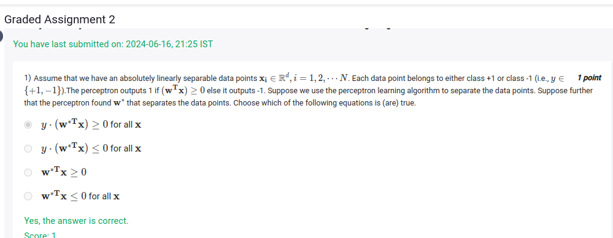

In the context of the perceptron learning algorithm and linearly separable data, let’s analyze each of the provided equations based on the given conditions.

## sol:
- lets say we are doing a +,- classification, for -ve points,since y -is also -ve, they cancel out and we end up at positive y.(wtx)>=0 for  all x

1. **Equation**: \( y \cdot (w^T x) \geq 0 \) for all \( x \)

   - **True**: Since the perceptron has found a weight vector \( w^* \) that separates the classes, it means that for any data point \( x_i \) belonging to class +1, \( w^T x_i \) will be greater than or equal to 0, and for class -1, \( w^T x_i \) will be less than or equal to 0. Therefore, this equation is satisfied for all \( x \).

2. **Equation**: \( y \cdot (w^T x) \leq 0 \) for all \( x \)

   - **False**: This statement suggests that for all data points \( x \), the product \( y \cdot (w^T x) \) is less than or equal to 0. This cannot be true for all \( x \) because it contradicts the requirement that the perceptron correctly classifies data points. Points in class +1 should yield a product that is non-negative.

3. **Equation**: \( w^T x \geq 0 \)

   - **False**: This equation would imply that the output of the perceptron is always non-negative, which is not the case. While \( w^T x \) is non-negative for points classified as +1, it will be negative for points classified as -1.

4. **Equation**: \( w^T x \leq 0 \) for all \( x \)

   - **False**: Similar to the previous point, this statement would imply that the output of the perceptron is always non-positive. This is also incorrect as it contradicts the behavior of the perceptron, which should output non-negative values for class +1 data points.

### Summary

The only correct equation is:

- \( y \cdot (w^T x) \geq 0 \) for all \( x \)

The others are false under the assumptions provided.