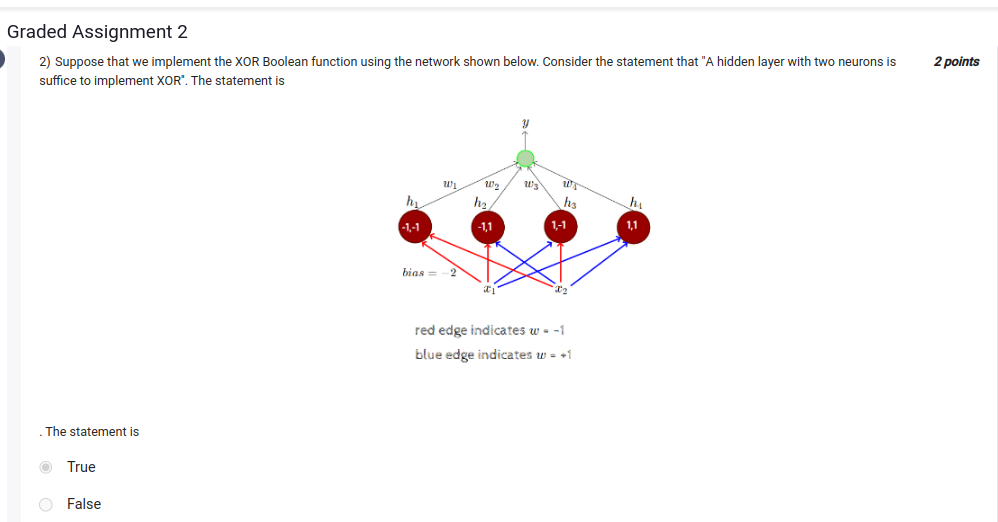

The statement "A hidden layer with two neurons is sufficient to implement XOR" is **true**.

The XOR function is not linearly separable, so a single-layer perceptron cannot solve it. However, by using a network with a hidden layer containing two neurons, as depicted in the diagram, it is possible to model XOR. Each hidden neuron applies a non-linear transformation to the input space, making the overall network capable of solving the XOR problem.

In the network you've shared, the hidden layer (with four neurons labeled \( h_1, h_2, h_3, h_4 \)) and the specific weights allow the network to transform the input space such that XOR logic can be represented in the final layer. Normally, two neurons are sufficient for XOR, but the network design here seems to use four neurons to map inputs more flexibly. 

Thus, the general principle is correct: a hidden layer with at least two neurons is sufficient to model the XOR function.