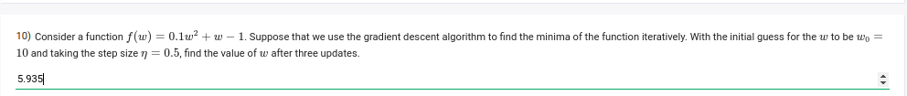

```python
import numpy as np

# Define the function and its gradient
def f(w):
    return 0.1 * w**2 + w - 1

def gradient(w):
    return 0.2 * w + 1

# Parameters
w = 10  # initial guess
step_size = 0.5  # learning rate
num_updates = 3  # number of updates

# Gradient descent updates
for _ in range(num_updates):
    w = w - step_size * gradient(w)

w  # value of w after three updates
```

## 5.935