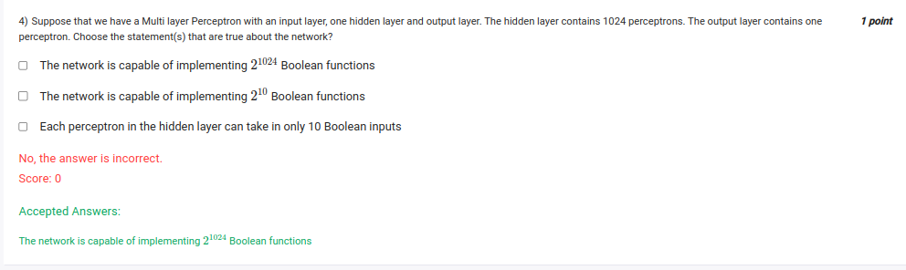

`2**2**n`

Let's break down the three statements and evaluate their truth:

### Statement 1: *The network is capable of implementing \(2^{1024}\) Boolean functions.*

- A perceptron in the output layer can implement any Boolean function of its inputs (the activations from the 1024 hidden layer units), but only **one** Boolean function of these 1024 inputs, not \(2^{1024}\). 
- \(2^{1024}\) refers to the number of possible Boolean functions of 1024 inputs, but the network, as described, implements a specific Boolean function based on its weights and biases.

Thus, this statement is **false**. The network cannot implement \(2^{1024}\) Boolean functions.

### Statement 2: *The network is capable of implementing \(2^{10}\) Boolean functions.*

- If this refers to the number of Boolean functions that can be implemented by the network overall, it is similarly not correct. The network with 1024 perceptrons can potentially represent complex Boolean functions, but it's certainly more than just \(2^{10}\). 
- However, if the statement were referring to a smaller subset or one specific element, it could apply, but as stated, it's **false** because the network can implement far more complex functions than just \(2^{10}\).

### Statement 3: *Each perceptron in the hidden layer can take in only 10 Boolean inputs.*

- This statement is likely describing the input layer configuration. But based on the description, there is no indication that each hidden unit is limited to just 10 inputs. Usually, the number of inputs to each hidden layer perceptron matches the number of neurons in the input layer. 
- Since there is no mention of the size of the input layer or a restriction of 10 Boolean inputs, this statement is **false**.

### Conclusion:
All three statements are **false**. The network is capable of representing more than \(2^{10}\) functions, cannot represent \(2^{1024}\) functions, and each hidden layer unit is not restricted to 10 inputs based on the given information.
