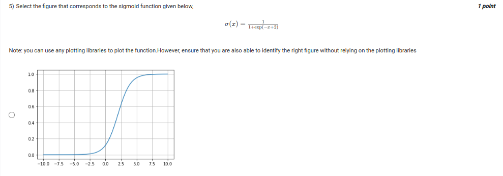
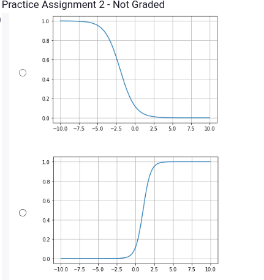
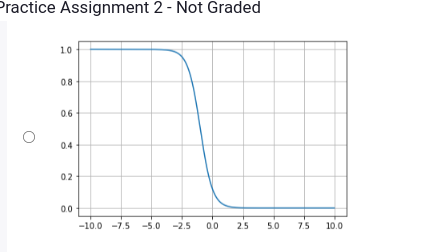
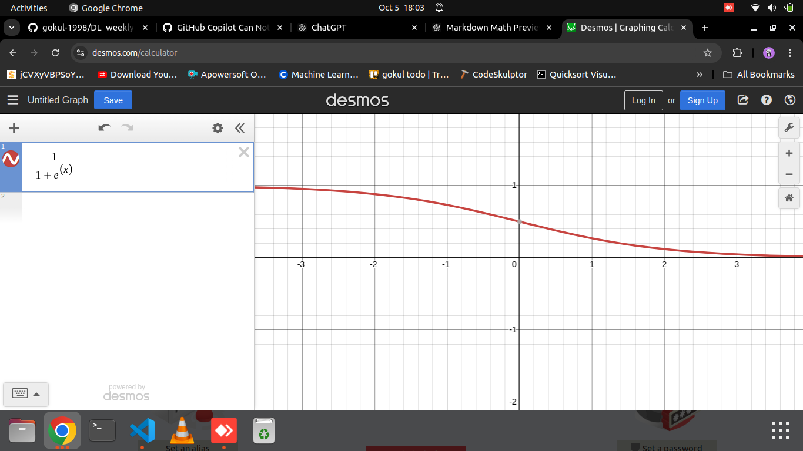
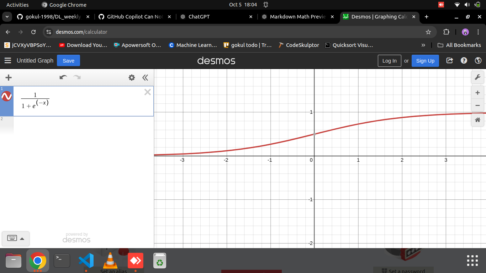
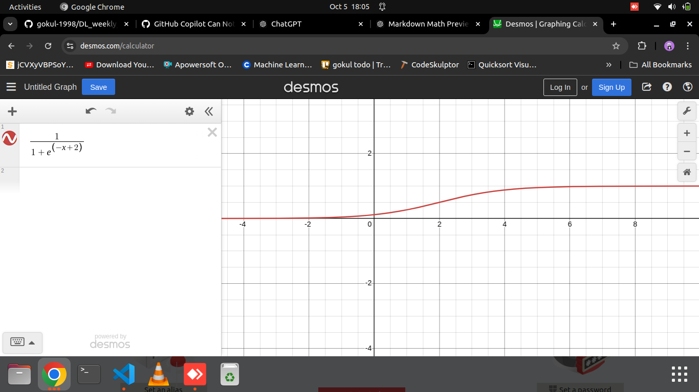
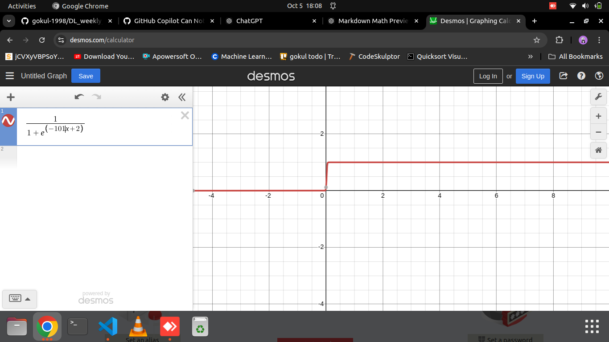

##
- the answer is 1 and not 3 because ,if you see, the sigmoid function is shifted to the right by 2 units. This means that the steepest part (0.5 in y axis) of the curve is at x=2. The inflection point is at x=2,
- in option 3 , it reachced 1 around 2.5 so close  to the  middle of the curve, so it is not the correct answer.

## Refer how the sign of x determine the shape of the sigmoid function

- in the  below fig,  we can see that as x=5, it nears the value 1, and as x=-5, it nears the value 0. So, the sigmoid function is a function that maps any real value to the range of 0 and 1.

the multiplication of x, determines how steep the curve is. The larger the value of x, the steeper the curve. The smaller the value of x, the flatter the curve.

\[
\sigma(x) = \frac{1}{1 + \exp(-x + 2)}
\]

### Characteristics of this sigmoid function:

1. **Shift**: The term \(-x + 2\) indicates a horizontal shift. Specifically, it shifts the curve to the right by 2 units. This results in the steepest part of the curve being at \(x = 2\).

2. **Asymptotes**:
   - As \(x \to -\infty\), \(\sigma(x) \to 0\).
   - As \(x \to \infty\), \(\sigma(x) \to 1\).

3. **Value at Inflection Point**:
   - The inflection point occurs where the function equals \(0.5\). To find this point:
     \[
     0.5 = \frac{1}{1 + \exp(-x + 2)}
     \]
     This simplifies to:
     \[
     1 + \exp(-x + 2) = 2 \implies \exp(-x + 2) = 1 \implies -x + 2 = 0 \implies x = 2
     \]
   - Therefore, \(\sigma(2) = 0.5\).

### Shape of the Function:
- The overall shape remains that of a standard sigmoid — an "S"-shaped curve.
- The steepest part of the curve will be at \(x = 2\) instead of \(x = 0\), which means it will pass through the point \((2, 0.5)\).

### Summary:
When you select a figure representing this function, look for:
- An "S"-shaped curve that has its steepest ascent around \(x = 2\).
- The function approaches 0 as \(x\) goes to \(-\infty\) and approaches 1 as \(x\) goes to \(\infty\).
  
Now, let's plot the function to visualize it.

Here’s the plot of the sigmoid function:

\[
\sigma(x) = \frac{1}{1 + \exp(-x + 2)}
\]

### Key Features Observed:
- The curve is **S-shaped** and approaches 0 as \(x \to -\infty\) and 1 as \(x \to \infty\).
- The **inflection point** is at \(x = 2\), where \(\sigma(2) = 0.5\), indicated by the vertical green dashed line.
- The horizontal dashed red line at \(y = 0.5\) shows where the curve intersects, confirming the steepest ascent occurs at this point.

When selecting a figure, ensure it resembles this shape, particularly with the shift to the right around \(x = 2\). If you have specific figures to evaluate, feel free to share them!