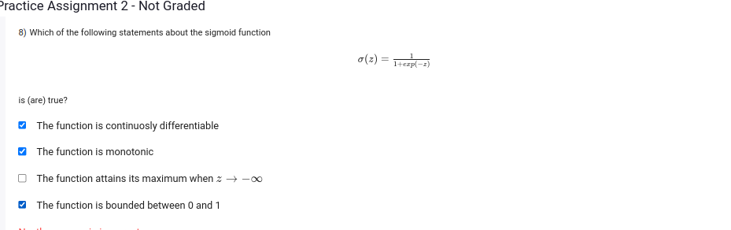

Let's evaluate each statement about the sigmoid function \(\sigma(z) = \frac{1}{1 + \exp(-z)}\):

1. **The function is continuously differentiable.**
   - **True.** The sigmoid function is differentiable everywhere, and its derivative \(\sigma'(z) = \sigma(z)(1 - \sigma(z))\) is also continuous.

2. **The function is monotonic.**
   - **True.** The sigmoid function is monotonically increasing because its derivative is always positive for all \(z\).

3. **The function attains its maximum when \(z \to -\infty\).**
   - **False.** As \(z \to -\infty\), \(\sigma(z) \to 0\). The maximum is approached as \(z \to +\infty\), where \(\sigma(z) \to 1\).

4. **The function is bounded between 0 and 1.**
   - **True.** The output of the sigmoid function ranges from 0 (as \(z \to -\infty\)) to 1 (as \(z \to +\infty\)), but never actually reaches these bounds.

### Summary:
- True statements: 1, 2, and 4
- False statement: 3

Thus, the true statements are that the function is continuously differentiable, monotonic, and bounded between 0 and 1.