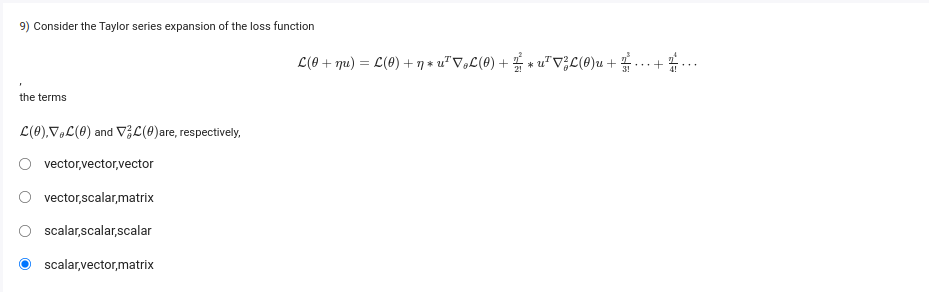

To analyze the terms in the Taylor series expansion of the loss function \( L(\theta + \eta u) \), let's clarify what each of the components represents:

1. **\( L(\theta) \)**:
   - This term represents the value of the loss function at \( \theta \).
   - **Type**: Scalar (the loss value is a single real number).

2. **\( \nabla_\theta L(\theta) \)**:
   - This is the gradient of the loss function with respect to \( \theta \). It represents the vector of partial derivatives.
   - **Type**: Vector (since it consists of the partial derivatives with respect to each parameter).

3. **\( \nabla_\theta^2 L(\theta) \)**:
   - This is the Hessian matrix of the loss function with respect to \( \theta \). It contains all the second-order partial derivatives.
   - **Type**: Matrix (as it summarizes how the gradient changes, with each element being a second derivative).

Based on this analysis, the correct classification of the terms is:

- \( L(\theta) \): **Scalar**
- \( \nabla_\theta L(\theta) \): **Vector**
- \( \nabla_\theta^2 L(\theta) \): **Matrix**

Thus, the correct answer is: **scalar, vector, matrix**.

# doubt